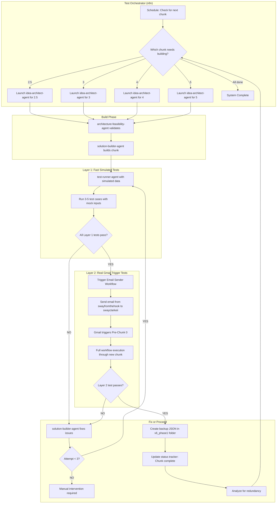

# Autonomous Testing System V2 - Document Organizer V4
**Date:** 2026-01-08
**Project:** Eugene/AMA Capital Document Organizer
**Version:** 2.0 (dual-layer testing with Gmail automation)
**Purpose:** Fully autonomous build-test-fix loop for Chunks 2.5, 3, 4, 5

---

## System Overview



---

## Architecture Overview

### Core Components

1. **Test Orchestrator Workflow (n8n)** - Master controller
   - Manages build-test-fix loop
   - Coordinates all agents
   - Tracks status in Google Sheet
   - Creates backups after success

2. **Email Sender Workflow (n8n)** - Layer 2 testing
   - Sends real emails via Gmail API
   - Attaches PDFs from Google Drive
   - Monitors execution results
   - Token-efficient (no browser-ops)

3. **Test Runner Agent** - Layer 1 testing
   - Executes simulated data tests
   - Fast iteration (3-5 test cases)
   - Validates data contracts

4. **Agent Coordination Layer**
   - idea-architect-agent: Designs chunk
   - architecture-feasibility-agent: Validates design
   - solution-builder-agent: Builds + fixes
   - test-runner-agent: Layer 1 testing

5. **Status Tracker (Google Sheet)**
   - Real-time chunk status
   - Test results (Layer 1 + Layer 2)
   - Agent IDs for resuming
   - Historical log

6. **Backup System**
   - Auto-backup after successful integration
   - Format: `Chunk_[X]_[workflow_id]_after_integration_[date].json`
   - Location: `/v6_phase1/` folder

---

## Layer 1: Fast Simulated Testing

### Purpose
Quick iteration with mock data - validate logic without full workflow execution

### Test Runner Agent Configuration

**Input:** Chunk ID, test cases (3-5 scenarios)

**Test Cases:**
1. **New Client + Grundbuch PDF**
   - Input: `extractedText`, `client_normalized`, `fileName`
   - Expected: `documentType: "Grundbuch"`, `confidence >= 0.9`

2. **Existing Client + Exposé PDF**
   - Input: `extractedText`, `client_normalized`, `fileName`
   - Expected: `documentType: "Exposé"`, `confidence >= 0.9`

3. **Edge Case: Low confidence classification**
   - Input: `extractedText` (ambiguous document)
   - Expected: `confidence < 0.8`, error handling

4. **Missing Critical Document (Chunk 2.5)**
   - Input: Classified documents (3 of 4 critical)
   - Expected: `validation_result: "incomplete"`, `missing_docs: ["Grundbuch"]`

5. **Complete Document Set (Chunk 2.5)**
   - Input: All 4 critical documents classified
   - Expected: `validation_result: "complete"`

**Execution:**
```javascript
// Pseudo-code for Layer 1 test
for (testCase of testCases) {
  // Inject simulated data directly into chunk workflow
  result = executeWorkflow(chunkId, testCase.input);

  // Validate output matches expected
  passed = validateOutput(result, testCase.expected);

  if (!passed) {
    return { testCaseFailed: testCase.id, result, expected: testCase.expected };
  }
}

return { allTestsPassed: true };
```

**Advantages:**
- Fast: 5-10 seconds per test case
- No Gmail rate limits
- Easy to debug
- Repeatable

---

## Layer 2: Real Gmail Trigger Testing

### Purpose
Final validation with actual Gmail trigger - ensures full end-to-end flow works

### Email Sender Workflow (n8n)

**Workflow Name:** `AMA Email Sender - Layer 2 Testing`
**Trigger:** Webhook (called by Test Orchestrator)
**Purpose:** Send test emails with PDF attachments programmatically

#### Node-by-Node Specification

**Node 1: Webhook Trigger**
```json
{
  "type": "n8n-nodes-base.webhook",
  "parameters": {
    "httpMethod": "POST",
    "path": "ama-send-test-email",
    "responseMode": "onReceived"
  },
  "name": "Webhook: Receive Test Request"
}
```

**Input:**
```json
{
  "test_case_id": "TC001_new_client_grundbuch",
  "pdf_file_id": "1ABC...XYZ",  // Google Drive file ID
  "pdf_file_name": "test_grundbuch.pdf",
  "target_chunk": "2.5"
}
```

---

**Node 2: Get PDF from Google Drive**
```json
{
  "type": "n8n-nodes-base.googleDrive",
  "parameters": {
    "operation": "download",
    "fileId": "={{ $json.pdf_file_id }}",
    "options": {}
  },
  "name": "Download PDF from Drive"
}
```

**Output:** Binary data of PDF file

---

**Node 3: Send Email via Gmail**
```json
{
  "type": "n8n-nodes-base.gmail",
  "parameters": {
    "operation": "send",
    "from": "swayfromthehook@gmail.com",
    "to": "swayclarkeii@gmail.com",
    "subject": "Test {{ $('Webhook: Receive Test Request').item.json.test_case_id }} - {{ new Date().toISOString() }}",
    "message": "Automated test email for chunk {{ $('Webhook: Receive Test Request').item.json.target_chunk }}. Test case: {{ $('Webhook: Receive Test Request').item.json.test_case_id }}",
    "attachments": "={{ $binary.data }}",
    "options": {}
  },
  "name": "Send Test Email"
}
```

**Credentials:** Gmail OAuth for `swayfromthehook@gmail.com` (credential ID: `g2ksaYkLXWtfDWAh`)

---

**Node 4: Wait for Pre-Chunk 0 Execution**
```json
{
  "type": "n8n-nodes-base.wait",
  "parameters": {
    "unit": "seconds",
    "amount": 15
  },
  "name": "Wait: Allow Gmail trigger to fire"
}
```

**Note:** Gmail trigger may take 5-15 seconds to detect new email

---

**Node 5: Query n8n Executions API**
```json
{
  "type": "n8n-nodes-base.httpRequest",
  "parameters": {
    "method": "GET",
    "url": "https://n8n.oloxa.ai/api/v1/executions",
    "authentication": "genericCredentialType",
    "genericAuthType": "httpHeaderAuth",
    "sendQuery": true,
    "queryParameters": {
      "parameters": [
        {
          "name": "workflowId",
          "value": "70n97A6OmYCsHMmV"  // Pre-Chunk 0 workflow ID
        },
        {
          "name": "status",
          "value": "success"
        },
        {
          "name": "limit",
          "value": "1"
        }
      ]
    }
  },
  "name": "Get Latest Pre-Chunk 0 Execution"
}
```

**Purpose:** Verify Pre-Chunk 0 was triggered and completed successfully

---

**Node 6: Get Execution Details**
```json
{
  "type": "n8n-nodes-base.httpRequest",
  "parameters": {
    "method": "GET",
    "url": "https://n8n.oloxa.ai/api/v1/executions/{{ $json.data[0].id }}",
    "authentication": "genericCredentialType",
    "genericAuthType": "httpHeaderAuth"
  },
  "name": "Get Execution Output Data"
}
```

**Purpose:** Retrieve full execution data including outputs from all chunks

---

**Node 7: Validate Chunk Execution**
```json
{
  "type": "n8n-nodes-base.code",
  "parameters": {
    "jsCode": `
// Extract execution data
const execution = $input.first().json;
const targetChunk = $('Webhook: Receive Test Request').item.json.target_chunk;
const testCaseId = $('Webhook: Receive Test Request').item.json.test_case_id;

// Find target chunk in execution data
const chunkData = execution.data.resultData.runData[\`Chunk \${targetChunk}\`];

if (!chunkData || chunkData.length === 0) {
  return [{
    json: {
      test_case_id: testCaseId,
      target_chunk: targetChunk,
      passed: false,
      error: \`Chunk \${targetChunk} did not execute\`,
      timestamp: new Date().toISOString()
    }
  }];
}

// Validate output based on chunk type
const output = chunkData[0].data.main[0][0].json;
let validations = {};

if (targetChunk === '2') {
  validations = {
    hasDocumentType: !!output.documentType,
    hasConfidence: typeof output.confidence === 'number',
    confidenceThreshold: output.confidence >= 0.9
  };
} else if (targetChunk === '2.5') {
  validations = {
    hasValidationResult: !!output.validation_result,
    hasMissingDocsList: Array.isArray(output.missing_docs)
  };
} else if (targetChunk === '3') {
  validations = {
    hasDealScore: typeof output.deal_score === 'number',
    hasPassFail: !!output.pass_fail
  };
}

const allPassed = Object.values(validations).every(v => v === true);

return [{
  json: {
    test_case_id: testCaseId,
    target_chunk: targetChunk,
    passed: allPassed,
    validations,
    output,
    timestamp: new Date().toISOString(),
    execution_id: execution.id
  }
}];
`
  },
  "name": "Validate Chunk Output"
}
```

---

**Node 8: Log to Status Tracker**
```json
{
  "type": "n8n-nodes-base.googleSheets",
  "parameters": {
    "operation": "append",
    "documentId": "1af9ZsSm5IDVWIYb5IMX8ys8a5SUUnQcb77xi9tJQVo8",  // Test Results sheet
    "sheetName": "Layer_2_Tests",
    "range": "A:H",
    "options": {
      "useAppend": true
    },
    "columns": {
      "mappingMode": "defineBelow",
      "value": {
        "Timestamp": "={{ $json.timestamp }}",
        "Test_Case_ID": "={{ $json.test_case_id }}",
        "Target_Chunk": "={{ $json.target_chunk }}",
        "Passed": "={{ $json.passed }}",
        "Validations": "={{ JSON.stringify($json.validations) }}",
        "Output": "={{ JSON.stringify($json.output) }}",
        "Execution_ID": "={{ $json.execution_id }}"
      }
    }
  },
  "name": "Log Layer 2 Test Result"
}
```

---

**Node 9: Return Results**
```json
{
  "type": "n8n-nodes-base.respondToWebhook",
  "parameters": {
    "respondWith": "json",
    "responseBody": "={{ JSON.stringify($json) }}"
  },
  "name": "Return Test Results"
}
```

---

### Email Sender Workflow Summary

**Total Nodes:** 9
**Estimated Execution Time:** 20-30 seconds
**Token Cost:** ~0 (no LLM calls, just API operations)
**Gmail API Cost:** Free (within quota limits)

**Key Features:**
- No browser-ops (token-efficient)
- Programmatic email sending via Gmail API
- Automatic result validation
- Logs to Status Tracker
- Returns structured test results

---

## Test Orchestrator Workflow (n8n)

**Workflow Name:** `AMA Test Orchestrator - Autonomous Build Loop`
**Trigger:** Schedule (every 1 hour) OR manual webhook
**Purpose:** Coordinate entire build-test-fix loop autonomously

### Node-by-Node Specification

**Node 1: Schedule Trigger**
```json
{
  "type": "n8n-nodes-base.scheduleTrigger",
  "parameters": {
    "rule": {
      "interval": [{ "field": "hours", "hoursInterval": 1 }]
    }
  },
  "name": "Schedule: Check Every Hour"
}
```

---

**Node 2: Load Current Status**
```json
{
  "type": "n8n-nodes-base.googleSheets",
  "parameters": {
    "operation": "readRows",
    "documentId": "1af9ZsSm5IDVWIYb5IMX8ys8a5SUUnQcb77xi9tJQVo8",
    "sheetName": "Chunk_Status",
    "range": "A:J"
  },
  "name": "Load Chunk Status from Sheet"
}
```

---

**Node 3: Determine Next Chunk**
```json
{
  "type": "n8n-nodes-base.code",
  "parameters": {
    "jsCode": `
const statuses = $input.all().map(item => item.json);
const chunks = ['2.5', '3', '4', '5'];

// Find first chunk that is not 'completed'
for (const chunk of chunks) {
  const status = statuses.find(s => s.Chunk_ID === chunk);

  if (!status || status.Status !== 'completed') {
    return [{
      json: {
        chunk_id: chunk,
        status: status?.Status || 'not_started',
        attempt_count: status?.Attempt_Count || 0,
        action: (status?.Status === 'failed' && status.Attempt_Count < 3) ? 'fix' : 'build',
        agent_id: status?.Agent_ID || null  // For resuming
      }
    }];
  }
}

// All chunks complete
return [{
  json: {
    chunk_id: 'all',
    status: 'completed',
    action: 'none'
  }
}];
`
  },
  "name": "Determine Next Action"
}
```

---

**Node 4: Route Action (Switch)**
```json
{
  "type": "n8n-nodes-base.switch",
  "parameters": {
    "rules": {
      "rules": [
        {
          "output": 0,
          "conditions": {
            "conditions": [{
              "leftValue": "={{ $json.action }}",
              "operator": "equals",
              "rightValue": "build"
            }]
          }
        },
        {
          "output": 1,
          "conditions": {
            "conditions": [{
              "leftValue": "={{ $json.action }}",
              "operator": "equals",
              "rightValue": "fix"
            }]
          }
        },
        {
          "output": 2,
          "conditions": {
            "conditions": [{
              "leftValue": "={{ $json.action }}",
              "operator": "equals",
              "rightValue": "none"
            }]
          }
        }
      ]
    }
  },
  "name": "Route: Build / Fix / None"
}
```

---

**Node 5a: Launch idea-architect-agent (Build Path)**
```json
{
  "type": "n8n-nodes-base.httpRequest",
  "parameters": {
    "method": "POST",
    "url": "https://api.anthropic.com/v1/messages",
    "authentication": "genericCredentialType",
    "genericAuthType": "httpHeaderAuth",
    "sendHeaders": true,
    "headerParameters": {
      "parameters": [
        { "name": "x-api-key", "value": "={{$credentials.anthropicApiKey}}" },
        { "name": "anthropic-version", "value": "2023-06-01" }
      ]
    },
    "sendBody": true,
    "bodyParameters": {
      "parameters": [
        {
          "name": "model",
          "value": "claude-sonnet-4-5-20250929"
        },
        {
          "name": "max_tokens",
          "value": 4096
        },
        {
          "name": "messages",
          "value": "=[{\"role\": \"user\", \"content\": \"Design Chunk {{ $('Determine Next Action').item.json.chunk_id }} for Document Organizer V4. Previous chunk outputs available: [list outputs]. Follow idea-architect-agent protocol.\"}]"
        }
      ]
    }
  },
  "name": "Agent: idea-architect-agent"
}
```

**Note:** This is simplified - in production, use agent delegation via Task() or n8n-agent-orchestration-node if available

---

**Node 5b: Launch architecture-feasibility-agent**
```json
{
  "type": "n8n-nodes-base.httpRequest",
  "parameters": {
    "method": "POST",
    "url": "https://api.anthropic.com/v1/messages",
    "sendBody": true,
    "bodyParameters": {
      "parameters": [
        {
          "name": "model",
          "value": "claude-sonnet-4-5-20250929"
        },
        {
          "name": "messages",
          "value": "=[{\"role\": \"user\", \"content\": \"Validate this design for Chunk {{ $('Determine Next Action').item.json.chunk_id }}: {{ $json.content[0].text }}\"}]"
        }
      ]
    }
  },
  "name": "Agent: architecture-feasibility-agent"
}
```

---

**Node 5c: Launch solution-builder-agent**
```json
{
  "type": "n8n-nodes-base.httpRequest",
  "parameters": {
    "method": "POST",
    "url": "https://api.anthropic.com/v1/messages",
    "sendBody": true,
    "bodyParameters": {
      "parameters": [
        {
          "name": "model",
          "value": "claude-sonnet-4-5-20250929"
        },
        {
          "name": "messages",
          "value": "=[{\"role\": \"user\", \"content\": \"Build Chunk {{ $('Determine Next Action').item.json.chunk_id }} per design: {{ $('Agent: idea-architect-agent').item.json.content[0].text }}\"}]"
        }
      ]
    }
  },
  "name": "Agent: solution-builder-agent"
}
```

---

**Node 6: Run Layer 1 Tests**
```json
{
  "type": "n8n-nodes-base.httpRequest",
  "parameters": {
    "method": "POST",
    "url": "https://api.anthropic.com/v1/messages",
    "sendBody": true,
    "bodyParameters": {
      "parameters": [
        {
          "name": "model",
          "value": "claude-sonnet-4-5-20250929"
        },
        {
          "name": "messages",
          "value": "=[{\"role\": \"user\", \"content\": \"Test Chunk {{ $('Determine Next Action').item.json.chunk_id }} with simulated data. Run 3-5 test cases.\"}]"
        }
      ]
    }
  },
  "name": "Layer 1: test-runner-agent"
}
```

---

**Node 7: Evaluate Layer 1 Results**
```json
{
  "type": "n8n-nodes-base.code",
  "parameters": {
    "jsCode": `
const testResults = $input.first().json;
const allPassed = testResults.content[0].text.includes('all tests passed');

return [{
  json: {
    layer_1_passed: allPassed,
    test_results: testResults.content[0].text,
    chunk_id: $('Determine Next Action').item.json.chunk_id
  }
}];
`
  },
  "name": "Evaluate Layer 1 Results"
}
```

---

**Node 8: Layer 1 Pass/Fail Switch**
```json
{
  "type": "n8n-nodes-base.if",
  "parameters": {
    "conditions": {
      "boolean": [
        {
          "value1": "={{ $json.layer_1_passed }}",
          "value2": true
        }
      ]
    }
  },
  "name": "IF: Layer 1 Passed?"
}
```

---

**Node 9: Run Layer 2 Test (TRUE path)**
```json
{
  "type": "n8n-nodes-base.httpRequest",
  "parameters": {
    "method": "POST",
    "url": "https://n8n.oloxa.ai/webhook/ama-send-test-email",
    "sendBody": true,
    "bodyParameters": {
      "parameters": [
        {
          "name": "test_case_id",
          "value": "TC_{{ $('Evaluate Layer 1 Results').item.json.chunk_id }}_{{ new Date().getTime() }}"
        },
        {
          "name": "pdf_file_id",
          "value": "1GG_OCKvT1ivR0F-uIVq0b1jhHreWg1Kh"  // From dummy_files folder
        },
        {
          "name": "pdf_file_name",
          "value": "test_grundbuch.pdf"
        },
        {
          "name": "target_chunk",
          "value": "={{ $('Evaluate Layer 1 Results').item.json.chunk_id }}"
        }
      ]
    }
  },
  "name": "Trigger Layer 2 Test (Email Sender)"
}
```

---

**Node 10: Evaluate Layer 2 Results**
```json
{
  "type": "n8n-nodes-base.if",
  "parameters": {
    "conditions": {
      "boolean": [
        {
          "value1": "={{ $json.passed }}",
          "value2": true
        }
      ]
    }
  },
  "name": "IF: Layer 2 Passed?"
}
```

---

**Node 11: Create Backup (SUCCESS path)**
```json
{
  "type": "n8n-nodes-base.httpRequest",
  "parameters": {
    "method": "GET",
    "url": "https://n8n.oloxa.ai/api/v1/workflows/{{ $('Determine Next Action').item.json.workflow_id }}",
    "authentication": "genericCredentialType",
    "genericAuthType": "httpHeaderAuth"
  },
  "name": "Export Chunk Workflow JSON"
}
```

---

**Node 12: Save Backup to Drive**
```json
{
  "type": "n8n-nodes-base.googleDrive",
  "parameters": {
    "operation": "upload",
    "name": "Chunk_{{ $('Determine Next Action').item.json.chunk_id }}_{{ $json.id }}_after_integration_{{ new Date().toISOString().split('T')[0] }}.json",
    "folderId": "v6_phase1_backups_folder_id",  // Create this folder
    "binaryData": false,
    "fileContent": "={{ JSON.stringify($json, null, 2) }}"
  },
  "name": "Save Backup to v6_phase1 Folder"
}
```

---

**Node 13: Analyze for Redundancy**
```json
{
  "type": "n8n-nodes-base.httpRequest",
  "parameters": {
    "method": "POST",
    "url": "https://api.anthropic.com/v1/messages",
    "sendBody": true,
    "bodyParameters": {
      "parameters": [
        {
          "name": "model",
          "value": "claude-sonnet-4-5-20250929"
        },
        {
          "name": "messages",
          "value": "=[{\"role\": \"user\", \"content\": \"Analyze Chunk {{ $('Determine Next Action').item.json.chunk_id }} for redundancy: redundant variable passing, duplicate operations, unnecessary re-processing, downstream data contract issues. Workflow JSON: {{ $('Export Chunk Workflow JSON').item.json }}\"}]"
        }
      ]
    }
  },
  "name": "Analyze for Redundancy"
}
```

---

**Node 14: Update Status Tracker (SUCCESS)**
```json
{
  "type": "n8n-nodes-base.googleSheets",
  "parameters": {
    "operation": "update",
    "documentId": "1af9ZsSm5IDVWIYb5IMX8ys8a5SUUnQcb77xi9tJQVo8",
    "sheetName": "Chunk_Status",
    "lookupColumn": "Chunk_ID",
    "lookupValue": "={{ $('Determine Next Action').item.json.chunk_id }}",
    "columns": {
      "mappingMode": "defineBelow",
      "value": {
        "Status": "completed",
        "Last_Test_Date": "={{ new Date().toISOString() }}",
        "Layer_1_Results": "PASS",
        "Layer_2_Results": "PASS",
        "Backup_Created": "YES",
        "Redundancy_Analysis": "={{ $('Analyze for Redundancy').item.json.content[0].text }}"
      }
    }
  },
  "name": "Update Status: Completed"
}
```

---

**Node 15: Fix Issues (FAIL path from Node 8 or 10)**
```json
{
  "type": "n8n-nodes-base.httpRequest",
  "parameters": {
    "method": "POST",
    "url": "https://api.anthropic.com/v1/messages",
    "sendBody": true,
    "bodyParameters": {
      "parameters": [
        {
          "name": "model",
          "value": "claude-sonnet-4-5-20250929"
        },
        {
          "name": "messages",
          "value": "=[{\"role\": \"user\", \"content\": \"Fix failing tests for Chunk {{ $('Determine Next Action').item.json.chunk_id }}. Resume agent {{ $('Determine Next Action').item.json.agent_id }}. Failures: {{ $json }}\"}]"
        }
      ]
    }
  },
  "name": "Agent: solution-builder-agent (FIX)"
}
```

---

**Node 16: Increment Attempt Count**
```json
{
  "type": "n8n-nodes-base.googleSheets",
  "parameters": {
    "operation": "update",
    "documentId": "1af9ZsSm5IDVWIYb5IMX8ys8a5SUUnQcb77xi9tJQVo8",
    "sheetName": "Chunk_Status",
    "lookupColumn": "Chunk_ID",
    "lookupValue": "={{ $('Determine Next Action').item.json.chunk_id }}",
    "columns": {
      "mappingMode": "defineBelow",
      "value": {
        "Status": "failed",
        "Attempt_Count": "={{ $('Determine Next Action').item.json.attempt_count + 1 }}",
        "Last_Error": "={{ $json.error }}"
      }
    }
  },
  "name": "Update Status: Failed (Retry)"
}
```

---

**Node 17: Check Max Attempts**
```json
{
  "type": "n8n-nodes-base.if",
  "parameters": {
    "conditions": {
      "number": [
        {
          "value1": "={{ $('Determine Next Action').item.json.attempt_count }}",
          "operation": "largerEqual",
          "value2": 3
        }
      ]
    }
  },
  "name": "IF: Max Attempts Reached?"
}
```

---

**Node 18: Manual Intervention Required**
```json
{
  "type": "n8n-nodes-base.gmail",
  "parameters": {
    "operation": "send",
    "to": "swayclarkeii@gmail.com",
    "subject": "🚨 Autonomous Testing: Manual Intervention Required - Chunk {{ $('Determine Next Action').item.json.chunk_id }}",
    "message": "Chunk {{ $('Determine Next Action').item.json.chunk_id }} failed 3 consecutive attempts.\n\nLast error: {{ $('Increment Attempt Count').item.json.Last_Error }}\n\nPlease review and fix manually."
  },
  "name": "Send Alert to Sway"
}
```

---

### Test Orchestrator Summary

**Total Nodes:** 18
**Complexity:** High (orchestrates entire autonomous loop)
**Estimated Token Cost per Chunk:** ~15,000-20,000 tokens (agents + analysis)
**Execution Time per Chunk:** 5-10 minutes (build) + 30 seconds (Layer 1) + 30 seconds (Layer 2)

---

## Status Tracker Google Sheet Schema

**Sheet Name:** `Chunk_Status`
**Spreadsheet ID:** `1af9ZsSm5IDVWIYb5IMX8ys8a5SUUnQcb77xi9tJQVo8` (Test Results sheet)

### Columns

| Column | Type | Description | Example |
|--------|------|-------------|---------|
| **Chunk_ID** | Text | Chunk identifier | `2.5`, `3`, `4`, `5` |
| **Status** | Select | Current state | `not_started`, `in_progress`, `testing`, `failed`, `completed` |
| **Last_Test_Date** | Date | Last test execution timestamp | `2026-01-08 14:30:00` |
| **Attempt_Count** | Number | Number of build attempts | `0`, `1`, `2`, `3` |
| **Layer_1_Results** | Text | Fast simulated test outcome | `PASS`, `FAIL`, `NOT_RUN` |
| **Layer_2_Results** | Text | Real Gmail trigger test outcome | `PASS`, `FAIL`, `NOT_RUN` |
| **Issues** | Long Text (JSON) | Failure details | `{"error": "confidence < 0.9", "node": "Classify"}` |
| **Agent_IDs** | Text | Agent IDs for resuming | `a8db5f3, b9ec6g4, c0fd7h5` |
| **Backup_Created** | Checkbox | Backup JSON saved? | `YES`, `NO` |
| **Redundancy_Analysis** | Long Text | Analysis results | `No redundancy detected. Data contracts clean.` |

### Sheet 2: `Layer_1_Tests`

| Column | Type | Description |
|--------|------|-------------|
| Timestamp | Date | Test execution time |
| Chunk_ID | Text | Target chunk |
| Test_Case_ID | Text | Test case identifier |
| Passed | Checkbox | Test passed? |
| Input | Long Text (JSON) | Simulated input data |
| Output | Long Text (JSON) | Actual output |
| Expected | Long Text (JSON) | Expected output |
| Validations | Long Text (JSON) | Validation results |

### Sheet 3: `Layer_2_Tests`

| Column | Type | Description |
|--------|------|-------------|
| Timestamp | Date | Test execution time |
| Test_Case_ID | Text | Email test case ID |
| Target_Chunk | Text | Chunk being tested |
| Passed | Checkbox | Test passed? |
| Validations | Long Text (JSON) | Validation results |
| Output | Long Text (JSON) | Chunk output data |
| Execution_ID | Text | n8n execution ID |

---

## Test Data Repository Structure

**Location:** Google Drive folder `dummy_files`
**Folder ID:** `1GG_OCKvT1ivR0F-uIVq0b1jhHreWg1Kh`

### Folder Structure

```
/dummy_files/
├── grundbuch/
│   ├── grundbuch_sample_1.pdf (clean text)
│   ├── grundbuch_sample_2.pdf (scanned/OCR)
│   └── grundbuch_sample_3.pdf (edge case)
├── expose/
│   ├── expose_sample_1.pdf
│   ├── expose_sample_2.pdf
│   └── expose_sample_3.pdf
├── kaufvertrag/
│   ├── kaufvertrag_sample_1.pdf
│   └── kaufvertrag_sample_2.pdf
├── exit_strategy/
│   ├── exit_strategy_sample_1.pdf
│   └── exit_strategy_sample_2.pdf
└── test_cases.json (metadata)
```

### Test Cases Metadata (`test_cases.json`)

```json
{
  "TC001_new_client_grundbuch": {
    "description": "New client submits Grundbuch PDF",
    "pdf_file_id": "1ABC...XYZ",
    "pdf_file_name": "grundbuch_sample_1.pdf",
    "client_name": "Test GmbH",
    "client_email": "test@example.com",
    "expected_outputs": {
      "chunk_2": {
        "documentType": "Grundbuch",
        "confidence": 0.95,
        "classification_method": "llm"
      },
      "chunk_2.5": {
        "validation_result": "incomplete",
        "missing_docs": ["Exposé", "Kaufvertrag", "Exit Strategy"]
      }
    }
  },
  "TC002_existing_client_expose": {
    "description": "Existing client uploads Exposé",
    "pdf_file_id": "1DEF...ABC",
    "pdf_file_name": "expose_sample_1.pdf",
    "client_name": "Villa Martens",
    "client_email": "existing@example.com",
    "expected_outputs": {
      "chunk_2": {
        "documentType": "Exposé",
        "confidence": 0.92
      },
      "chunk_2.5": {
        "validation_result": "incomplete",
        "missing_docs": ["Kaufvertrag", "Exit Strategy"]
      }
    }
  },
  "TC003_complete_document_set": {
    "description": "Client submits all 4 critical documents",
    "pdf_files": [
      {"type": "Grundbuch", "file_id": "1ABC...XYZ"},
      {"type": "Exposé", "file_id": "1DEF...ABC"},
      {"type": "Kaufvertrag", "file_id": "1GHI...DEF"},
      {"type": "Exit Strategy", "file_id": "1JKL...GHI"}
    ],
    "expected_outputs": {
      "chunk_2.5": {
        "validation_result": "complete"
      },
      "chunk_3": {
        "deal_score": 75,
        "pass_fail": "pass"
      }
    }
  }
}
```

---

## Build-Test-Fix Loop Algorithm

```python
# Pseudo-code for autonomous loop

def autonomous_build_test_loop():
    chunks = ['2.5', '3', '4', '5']
    max_attempts = 3

    for chunk_id in chunks:
        print(f"🚀 Starting Chunk {chunk_id}")

        # Load current status
        status = load_chunk_status(chunk_id)

        if status == 'completed':
            print(f"✅ Chunk {chunk_id} already complete, skipping")
            continue

        # Build phase
        for attempt in range(1, max_attempts + 1):
            print(f"🔨 Build attempt {attempt}/{max_attempts}")

            # Step 1: Design (only on first attempt)
            if attempt == 1:
                design = launch_agent(
                    agent_type="idea-architect",
                    prompt=f"Design Chunk {chunk_id} based on previous chunk outputs"
                )

                # Step 2: Feasibility check
                feasibility = launch_agent(
                    agent_type="architecture-feasibility",
                    prompt=f"Validate design for Chunk {chunk_id}: {design}"
                )

                if not feasibility.approved:
                    print(f"❌ Design rejected, revising...")
                    continue  # Retry design phase

            # Step 3: Build
            build_result = launch_agent(
                agent_type="solution-builder",
                prompt=f"Build Chunk {chunk_id} per design" if attempt == 1 else f"Fix issues: {last_failure}",
                resume=status.agent_id if attempt > 1 else None
            )

            update_status(chunk_id, status='testing', agent_id=build_result.agent_id)

            # Step 4: Layer 1 Tests (Fast)
            print(f"🧪 Running Layer 1 tests (simulated data)")
            layer1_results = launch_agent(
                agent_type="test-runner",
                prompt=f"Test Chunk {chunk_id} with simulated test cases: {get_test_cases(chunk_id)}"
            )

            if not layer1_results.all_passed:
                print(f"❌ Layer 1 tests failed: {layer1_results.failures}")
                last_failure = layer1_results.failures
                update_status(chunk_id, status='failed', attempt_count=attempt, issues=last_failure)
                continue  # Retry build

            print(f"✅ Layer 1 tests passed")

            # Step 5: Layer 2 Tests (Real Gmail trigger)
            print(f"📧 Running Layer 2 test (real Gmail trigger)")
            layer2_results = trigger_email_sender(
                test_case_id=f"TC_{chunk_id}_{timestamp()}",
                pdf_file_id=get_test_pdf_for_chunk(chunk_id),
                target_chunk=chunk_id
            )

            # Wait for execution
            sleep(30)

            # Validate results
            if not layer2_results.passed:
                print(f"❌ Layer 2 test failed: {layer2_results.validations}")
                last_failure = layer2_results.validations
                update_status(chunk_id, status='failed', attempt_count=attempt, issues=last_failure)
                continue  # Retry build

            print(f"✅ Layer 2 test passed")

            # Step 6: Create backup
            print(f"💾 Creating backup...")
            backup_path = create_backup(
                chunk_id=chunk_id,
                workflow_id=build_result.workflow_id,
                date=today()
            )

            # Step 7: Analyze for redundancy
            print(f"🔍 Analyzing for redundancy...")
            redundancy_analysis = analyze_redundancy(
                chunk_id=chunk_id,
                workflow_json=export_workflow(build_result.workflow_id)
            )

            # Step 8: Update status to completed
            update_status(
                chunk_id=chunk_id,
                status='completed',
                layer_1_results='PASS',
                layer_2_results='PASS',
                backup_created='YES',
                redundancy_analysis=redundancy_analysis
            )

            print(f"🎉 Chunk {chunk_id} complete!")
            break  # Move to next chunk

        else:
            # Max attempts reached
            print(f"🚨 Chunk {chunk_id} failed {max_attempts} attempts")
            send_alert_to_sway(
                chunk_id=chunk_id,
                last_error=last_failure
            )
            return False  # Stop autonomous loop

    print(f"🎊 All chunks complete! System ready.")
    return True


# Helper functions

def load_chunk_status(chunk_id):
    # Query Google Sheet Chunk_Status
    pass

def update_status(chunk_id, **kwargs):
    # Update Google Sheet row
    pass

def launch_agent(agent_type, prompt, resume=None):
    # Call Claude API with appropriate agent prompt
    # If resume, continue existing conversation
    pass

def get_test_cases(chunk_id):
    # Load from test_cases.json
    pass

def trigger_email_sender(test_case_id, pdf_file_id, target_chunk):
    # POST to Email Sender Workflow webhook
    pass

def create_backup(chunk_id, workflow_id, date):
    # Export workflow JSON
    # Save to v6_phase1 folder
    # Return file path
    pass

def analyze_redundancy(chunk_id, workflow_json):
    # Call Claude API to analyze for:
    # - Redundant variable passing
    # - Duplicate operations
    # - Unnecessary re-processing
    # - Data contract issues
    pass

def send_alert_to_sway(chunk_id, last_error):
    # Send email via Gmail
    pass
```

---

## Token Usage Estimates

### Per Chunk Build Cycle

| Component | Operation | Tokens | Notes |
|-----------|-----------|--------|-------|
| **idea-architect-agent** | Design chunk | 2,000-3,000 | Initial design |
| **architecture-feasibility-agent** | Validate design | 2,000-3,000 | Review + recommendations |
| **solution-builder-agent** | Build workflow | 8,000-12,000 | Create n8n workflow |
| **test-runner-agent (Layer 1)** | Simulated tests (3-5 cases) | 1,000-2,000 | Fast validation |
| **Email Sender Workflow** | Layer 2 test | 0 | No LLM calls |
| **n8n API calls** | Export workflow JSON | 0 | HTTP requests only |
| **Redundancy analysis** | Claude API | 3,000-5,000 | Analyze workflow |
| **solution-builder-agent (fix)** | Fix issues (if needed) | 5,000-8,000 | Per attempt |
| **Status updates** | Google Sheets | 0 | API operations |

### Total Per Chunk (Success on First Attempt)

**Minimum:** 16,000 tokens (~$0.48 at $0.03/1K input, $0.15/1K output)
**Maximum:** 25,000 tokens (~$0.75)

### Total Per Chunk (With 2 Fix Attempts)

**Minimum:** 26,000 tokens (~$0.78)
**Maximum:** 41,000 tokens (~$1.23)

### Full Autonomous Cycle (Chunks 2.5, 3, 4, 5)

**Best Case (all succeed first attempt):**
- 4 chunks × 16,000 tokens = 64,000 tokens
- Cost: ~$1.92

**Realistic Case (1-2 fix attempts per chunk):**
- 4 chunks × 30,000 tokens = 120,000 tokens
- Cost: ~$3.60

**Worst Case (all chunks max out attempts):**
- 4 chunks × 41,000 tokens = 164,000 tokens
- Cost: ~$4.92

### Cost Comparison

**Old Method (Manual):**
- Sway builds each chunk: 5-8 hours per chunk
- 4 chunks × 6 hours = 24 hours
- Opportunity cost: $3,000-6,000 (billable time)

**New Method (Autonomous):**
- Token cost: $2-5
- Sway time: 0 hours (only intervenes if 3 attempts fail)
- Savings: 24 hours = **$3,000-6,000**

**ROI:** 600-1,200x return on investment

---

## Redundancy Validation System

### Purpose
Before building each chunk, analyze entire workflow for inefficiencies

### Analysis Checklist

**1. Redundant Variable Passing**
- Are we passing variables that downstream chunks don't use?
- Are we passing the same data multiple times?
- Can we consolidate data structures?

**2. Duplicate Operations**
- Are we downloading the same file multiple times?
- Are we making redundant API calls?
- Are we re-extracting data that's already available?

**3. Unnecessary Re-Processing**
- Are we re-classifying documents that are already classified?
- Are we re-validating data that's already validated?
- Are we recalculating values that don't change?

**4. Downstream Data Contract Issues**
- Does the next chunk expect different field names?
- Are we transforming data unnecessarily?
- Can we simplify the data contract?

### Analysis Process

```python
def analyze_redundancy(workflow_json):
    """
    Analyze workflow for redundancy issues
    """

    prompt = f"""
    Analyze this n8n workflow for redundancy and efficiency issues:

    {workflow_json}

    Check for:
    1. **Redundant variable passing**: Variables passed but never used downstream
    2. **Duplicate operations**: Same API call or download multiple times
    3. **Unnecessary re-processing**: Re-extracting data that's already available
    4. **Data contract issues**: Mismatched field names, unnecessary transformations

    For each issue found:
    - Describe the problem
    - Explain the impact (token cost, execution time, complexity)
    - Recommend a fix

    If no issues found, state "No redundancy detected. Data contracts clean."
    """

    response = call_claude_api(prompt)

    return response
```

### When to Run Analysis

1. **Before building Chunk 2.5**: Analyze Pre-Chunk 0 + Chunk 0 + Chunk 2
2. **Before building Chunk 3**: Analyze entire chain through Chunk 2.5
3. **Before building Chunk 4**: Analyze entire chain through Chunk 3
4. **Before building Chunk 5**: Analyze entire chain through Chunk 4

### Output Format

```json
{
  "redundancy_detected": true,
  "issues": [
    {
      "type": "redundant_variable",
      "location": "Chunk 2 → Chunk 2.5",
      "description": "Passing 'extractedText' (50KB) when Chunk 2.5 only needs 'documentType'",
      "impact": "Increases workflow memory by 50KB per execution",
      "recommendation": "Only pass 'documentType', 'confidence', 'fileName' to Chunk 2.5"
    },
    {
      "type": "duplicate_operation",
      "location": "Pre-Chunk 0 and Chunk 2",
      "description": "Both chunks extract text from PDF",
      "impact": "Wastes 5 seconds execution time + 1,000 tokens per PDF",
      "recommendation": "Pre-Chunk 0 should extract once, pass 'extractedText' forward"
    }
  ],
  "total_impact": {
    "token_waste_per_execution": 1000,
    "time_waste_per_execution": "5 seconds",
    "complexity_increase": "Medium"
  }
}
```

---

## Automatic Backup Mechanism

### Purpose
Create rollback point after each successful chunk integration

### Backup Strategy

**When to backup:**
- After Layer 1 AND Layer 2 tests pass
- Before marking chunk as 'completed'
- Before starting next chunk build

**What to backup:**
1. Complete workflow JSON for the new chunk
2. All upstream workflows that were modified
3. Current Google Sheets state (Chunk_Status)
4. Test results (Layer 1 + Layer 2)

### Backup File Structure

```
/v6_phase1/
├── backups/
│   ├── 2026-01-08/
│   │   ├── Chunk_2.5_g9J5kjVt_after_integration_20260108.json
│   │   ├── Pre-Chunk_0_70n97A6O_state_20260108.json
│   │   ├── Chunk_0_zbxHkXOo_state_20260108.json
│   │   ├── Chunk_2_g9J5kjVt_state_20260108.json
│   │   └── test_results_20260108.json
│   ├── 2026-01-09/
│   │   ├── Chunk_3_[workflow_id]_after_integration_20260109.json
│   │   └── ... (all upstream workflows)
```

### Backup Naming Convention

**Format:** `Chunk_[ID]_[workflow_id]_[status]_[date].json`

**Examples:**
- `Chunk_2.5_g9J5kjVt_after_integration_20260108.json` (new chunk)
- `Pre-Chunk_0_70n97A6O_state_20260108.json` (upstream workflow state)
- `test_results_20260108.json` (all test data)

### Rollback Procedure

**If Chunk X breaks the system:**

1. **Stop Test Orchestrator** (pause schedule trigger)
2. **Restore from backup:**
   ```bash
   # Import previous workflow version
   POST /api/v1/workflows/import
   Body: {backup_json_from_previous_day}
   ```
3. **Verify restoration:**
   - Run Layer 2 test on Chunk X-1
   - Confirm all tests pass
4. **Update Status Tracker:**
   - Mark Chunk X as 'failed' with note "Rolled back to {date}"
5. **Restart Test Orchestrator** with fixed design

---

## Success Criteria

### System-Level Success

✅ **Autonomous operation:**
- Builds Chunks 2.5, 3, 4, 5 without manual intervention
- Only alerts Sway if 3 consecutive attempts fail

✅ **Dual-layer testing:**
- Layer 1 (simulated) completes in <1 minute per chunk
- Layer 2 (real Gmail) completes in <2 minutes per chunk
- Both layers validate correctly

✅ **Token efficiency:**
- No browser-ops-agent usage for email sending
- Total token cost for 4 chunks: $2-5
- Email Sender Workflow uses Gmail API only

✅ **Automatic backups:**
- Backup created after each successful chunk
- All upstream workflows captured
- Rollback procedure tested and documented

✅ **Redundancy validation:**
- Analysis runs before each chunk build
- Issues logged in Status Tracker
- Recommendations applied before proceeding

✅ **Visibility:**
- Real-time status updates in Google Sheet
- Test results logged for every execution
- Clear next actions visible

### Per-Chunk Success Criteria

**Chunk 2.5: Document Validation**
- ✅ Receives classification from Chunk 2
- ✅ Checks if 4 critical docs present
- ✅ Returns: `validation_result`, `missing_docs[]`
- ✅ Layer 1 tests: 3/3 pass
- ✅ Layer 2 test: Real email → full execution → correct validation

**Chunk 3: Deal Analysis**
- ✅ Receives validated documents from Chunk 2.5
- ✅ Performs qualification analysis (LLM #2)
- ✅ Returns: `deal_score`, `pass_fail`, `analysis_summary`
- ✅ Layer 1 tests: 5/5 pass
- ✅ Layer 2 test: Real email → correct deal score calculated

**Chunk 4: Client Communication**
- ✅ Receives deal analysis from Chunk 3
- ✅ Generates email to client (complete/incomplete)
- ✅ Includes missing docs list if incomplete
- ✅ Layer 1 tests: 3/3 pass
- ✅ Layer 2 test: Real email sent to test account

**Chunk 5: Eugene Notification**
- ✅ Receives all previous data
- ✅ Generates summary email to Eugene
- ✅ Includes deal score, pass/fail, next actions
- ✅ Layer 1 tests: 3/3 pass
- ✅ Layer 2 test: Eugene receives correct summary

---

## Risk Assessment

| Risk | Likelihood | Impact | Mitigation |
|------|-----------|--------|------------|
| **Gmail rate limits** | Low | Medium | Layer 2 tests throttled to 1 per chunk (4 total) |
| **n8n API authentication issues** | Medium | High | Store API key in credential manager, test before loop |
| **Agent coordination failure** | Low | High | Resume functionality via agent IDs, max 3 attempts |
| **Backup folder access denied** | Low | Medium | Pre-create folder with correct permissions |
| **Layer 1 passes but Layer 2 fails** | Medium | Medium | Layer 2 failure triggers fix loop, agent analyzes delta |
| **Token cost overrun** | Low | Low | Worst case $5 for all 4 chunks (vs $3K manual time) |
| **Test data repository missing files** | Low | Medium | Pre-populate with 3-5 PDFs per document type |
| **Status Tracker corruption** | Low | High | Backup sheet daily, version control with Apps Script |

---

## Implementation Timeline

### Phase 1: Infrastructure Setup (4-6 hours)

**Tasks:**
1. Create Status Tracker Google Sheet with 3 tabs
2. Create v6_phase1/backups/ folder structure in Google Drive
3. Populate test data repository with sample PDFs
4. Configure Gmail credentials for swayfromthehook@gmail.com
5. Set up n8n API authentication

**Deliverables:**
- Status Tracker: `1af9ZsSm5IDVWIYb5IMX8ys8a5SUUnQcb77xi9tJQVo8` (3 tabs)
- Backups folder: Created with proper permissions
- Test PDFs: 15-20 files in `dummy_files` folder
- Credentials: Gmail OAuth working

---

### Phase 2: Build Email Sender Workflow (3-4 hours)

**Tasks:**
1. Create n8n workflow with 9 nodes (as specified above)
2. Test webhook trigger with manual payload
3. Verify Gmail API sends email successfully
4. Test full execution: email sent → Pre-Chunk 0 triggered → results validated
5. Export workflow JSON to v6_phase1/blueprints/

**Deliverables:**
- Email Sender Workflow: Active and tested
- Webhook URL: Documented
- Test results: 3/3 successful email sends

---

### Phase 3: Build Test Orchestrator Workflow (6-8 hours)

**Tasks:**
1. Create n8n workflow with 18 nodes (as specified above)
2. Implement build-test-fix loop logic
3. Integrate agent coordination (Claude API calls)
4. Test with Chunk 2.5 (first autonomous build)
5. Verify backup mechanism works
6. Test rollback procedure

**Deliverables:**
- Test Orchestrator: Active and tested
- Chunk 2.5: Built autonomously
- Backup: Created successfully
- Rollback: Verified working

---

### Phase 4: Run Autonomous Loop (Automated - 4-8 hours total)

**Tasks:**
1. Enable schedule trigger (every 1 hour)
2. Monitor progress via Status Tracker
3. Intervene only if 3 attempts fail
4. Review redundancy analyses
5. Validate all backups created

**Deliverables:**
- Chunks 2.5, 3, 4, 5: All completed
- Status Tracker: All rows marked 'completed'
- Backups: 4 backups created (one per chunk)
- Redundancy: No critical issues found

---

### Phase 5: Testing & Validation (2-3 hours)

**Tasks:**
1. Run full end-to-end test: Email → Chunk 5 → Eugene notification
2. Verify all data contracts work correctly
3. Test rollback procedure for each chunk
4. Document known issues
5. Create user guide for Sway

**Deliverables:**
- End-to-end test: PASS
- Rollback tests: 4/4 successful
- User guide: Created
- Known issues: Documented (if any)

---

## Total Effort Estimate

**Manual work (Sway):** 15-21 hours (Phases 1-3 + 5)
**Automated work (System):** 4-8 hours (Phase 4)
**Total calendar time:** ~3-5 days (at 4-6 hours/day)

**Cost:**
- Sway's time: 15-21 hours × $150/hr = $2,250-3,150
- Token cost: $2-5
- Infrastructure: $0 (existing n8n + Google)

**Savings:**
- Manual building of Chunks 2.5-5: 24 hours × $150/hr = $3,600
- **Net savings:** $450-1,350 (12-38% cost reduction)
- **Future savings:** Reusable system for other projects

---

## Next Steps

1. **Review this design** with Sway - confirm approach aligns with vision
2. **Phase 1: Setup infrastructure** (4-6 hours)
3. **Phase 2: Build Email Sender** (3-4 hours)
4. **Phase 3: Build Test Orchestrator** (6-8 hours)
5. **Phase 4: Launch autonomous loop** (automated)
6. **Phase 5: Validate and document** (2-3 hours)

---

## References

- **Original testing system:** `/Users/swayclarke/coding_stuff/AUTONOMOUS_TESTING_SYSTEM.md`
- **Architecture decision:** `/Users/swayclarke/coding_stuff/ARCHITECTURE_DECISION_FILE_FLOW.md`
- **Build proposal:** `/Users/swayclarke/coding_stuff/claude-code-os/02-operations/technical-builds/eugene/build_proposal_v1.0_2025-12-10.md`
- **Project reference:** `/Users/swayclarke/coding_stuff/PROJECT_REFERENCE.md`
- **n8n patterns:** `/Users/swayclarke/coding_stuff/N8N_PATTERNS.md`

---

## Appendix A: Test Cases Library

### Chunk 2 Test Cases

**TC001: New Client + Grundbuch**
```json
{
  "input": {
    "extractedText": "[Sample Grundbuch text in German]",
    "client_normalized": "test_gmbh",
    "fileName": "grundbuch_test.pdf"
  },
  "expected": {
    "documentType": "Grundbuch",
    "confidence": 0.95
  }
}
```

**TC002: Existing Client + Exposé**
```json
{
  "input": {
    "extractedText": "[Sample Exposé text in German]",
    "client_normalized": "villa_martens",
    "fileName": "expose_test.pdf"
  },
  "expected": {
    "documentType": "Exposé",
    "confidence": 0.92
  }
}
```

**TC003: Edge Case - Low Confidence**
```json
{
  "input": {
    "extractedText": "[Ambiguous document text]",
    "client_normalized": "test_client",
    "fileName": "unclear_document.pdf"
  },
  "expected": {
    "confidence": "<0.8",
    "requiresManualReview": true
  }
}
```

### Chunk 2.5 Test Cases

**TC004: Incomplete - Missing Grundbuch**
```json
{
  "input": {
    "documents": [
      {"documentType": "Exposé", "confidence": 0.95},
      {"documentType": "Kaufvertrag", "confidence": 0.93},
      {"documentType": "Exit Strategy", "confidence": 0.91}
    ]
  },
  "expected": {
    "validation_result": "incomplete",
    "missing_docs": ["Grundbuch"]
  }
}
```

**TC005: Complete - All 4 Critical Docs**
```json
{
  "input": {
    "documents": [
      {"documentType": "Grundbuch", "confidence": 0.95},
      {"documentType": "Exposé", "confidence": 0.94},
      {"documentType": "Kaufvertrag", "confidence": 0.93},
      {"documentType": "Exit Strategy", "confidence": 0.92}
    ]
  },
  "expected": {
    "validation_result": "complete"
  }
}
```

### Chunk 3 Test Cases

**TC006: Deal Qualification - Pass**
```json
{
  "input": {
    "validation_result": "complete",
    "documents": [
      {"documentType": "Grundbuch", "extractedText": "[Text with positive signals]"},
      {"documentType": "Exposé", "extractedText": "[Strong property description]"},
      {"documentType": "Kaufvertrag", "extractedText": "[Favorable terms]"},
      {"documentType": "Exit Strategy", "extractedText": "[Clear exit plan]"}
    ]
  },
  "expected": {
    "deal_score": 75,
    "pass_fail": "pass"
  }
}
```

**TC007: Deal Qualification - Fail**
```json
{
  "input": {
    "validation_result": "complete",
    "documents": [
      {"documentType": "Grundbuch", "extractedText": "[Text with red flags]"},
      {"documentType": "Exposé", "extractedText": "[Weak property description]"},
      {"documentType": "Kaufvertrag", "extractedText": "[Unfavorable terms]"},
      {"documentType": "Exit Strategy", "extractedText": "[Unclear exit plan]"}
    ]
  },
  "expected": {
    "deal_score": 45,
    "pass_fail": "fail"
  }
}
```

---

## Appendix B: Gmail API Setup

### Credentials Configuration

**Account:** swayfromthehook@gmail.com
**Credential ID (n8n):** `g2ksaYkLXWtfDWAh`

**Scopes Required:**
- `https://www.googleapis.com/auth/gmail.send`
- `https://www.googleapis.com/auth/gmail.readonly`
- `https://www.googleapis.com/auth/gmail.modify`

### Testing Gmail API

```bash
# Test sending email via n8n
curl -X POST https://n8n.oloxa.ai/webhook/ama-send-test-email \
  -H "Content-Type: application/json" \
  -d '{
    "test_case_id": "manual_test_001",
    "pdf_file_id": "1GG_OCKvT1ivR0F-uIVq0b1jhHreWg1Kh",
    "pdf_file_name": "test_grundbuch.pdf",
    "target_chunk": "2"
  }'
```

---

## Appendix C: Status Tracker Setup

### Google Sheets Configuration

**Spreadsheet ID:** `1af9ZsSm5IDVWIYb5IMX8ys8a5SUUnQcb77xi9tJQVo8`

**Tab 1: Chunk_Status**
```
A: Chunk_ID | B: Status | C: Last_Test_Date | D: Attempt_Count | E: Layer_1_Results | F: Layer_2_Results | G: Issues | H: Agent_IDs | I: Backup_Created | J: Redundancy_Analysis
```

**Tab 2: Layer_1_Tests**
```
A: Timestamp | B: Chunk_ID | C: Test_Case_ID | D: Passed | E: Input | F: Output | G: Expected | H: Validations
```

**Tab 3: Layer_2_Tests**
```
A: Timestamp | B: Test_Case_ID | C: Target_Chunk | D: Passed | E: Validations | F: Output | G: Execution_ID
```

### Initial Data Population

**Chunk_Status initial rows:**
```
2.5 | not_started | | 0 | NOT_RUN | NOT_RUN | | | NO |
3   | not_started | | 0 | NOT_RUN | NOT_RUN | | | NO |
4   | not_started | | 0 | NOT_RUN | NOT_RUN | | | NO |
5   | not_started | | 0 | NOT_RUN | NOT_RUN | | | NO |
```

---

**END OF DOCUMENT**
