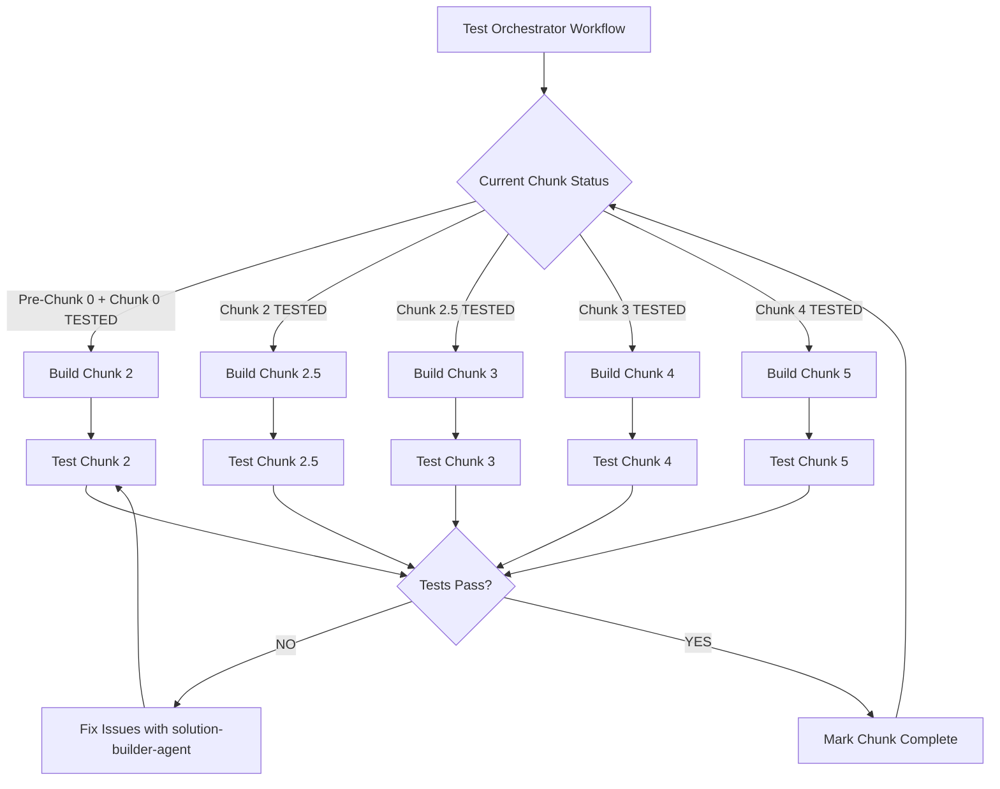

# Autonomous Testing & Build System
**Date:** 2026-01-08
**Purpose:** Fully automated testing for progressive chunk development
**Goal:** Build and test Chunks 2, 2.5, 3, 4, 5 without manual intervention

---

## System Overview



---

## Architecture

### Components

1. **Test Orchestrator Workflow** (n8n)
   - Manages build-test-fix loop
   - Tracks chunk completion status
   - Triggers agents based on test results

2. **Test Harness Workflow** (n8n)
   - Simulates email trigger with test data
   - Injects test PDFs and metadata
   - Executes Pre-Chunk 0 with controlled input

3. **Test Data Repository** (Google Drive)
   - Sample PDFs for each document type
   - Test cases with expected outputs
   - Validation criteria per chunk

4. **Agent Coordination Layer**
   - **idea-architect-agent**: Designs each chunk
   - **architecture-feasibility-agent**: Validates design
   - **solution-builder-agent**: Builds chunk
   - **test-runner-agent**: Executes tests
   - **solution-builder-agent** (fix loop): Fixes failures

5. **Status Tracker** (Google Sheet)
   - Chunk completion status
   - Test results history
   - Known issues log

---

## Test Harness Design

### Test Harness Workflow (ID: TBD)

```javascript
// N8N Workflow: "AMA Test Harness"
{
  "name": "AMA Test Harness",
  "nodes": [
    {
      "id": "webhook-trigger",
      "name": "Webhook Trigger",
      "type": "n8n-nodes-base.webhook",
      "parameters": {
        "httpMethod": "POST",
        "path": "ama-test-harness",
        "responseMode": "onReceived"
      }
    },
    {
      "id": "load-test-case",
      "name": "Load Test Case",
      "type": "n8n-nodes-base.code",
      "parameters": {
        "jsCode": `
// Load test case from input or use default
const testCases = {
  "new_client_grundbuch": {
    client_name: "Test GmbH",
    client_email: "test@example.com",
    pdf_file_id: "TEST_GRUNDBUCH_FILE_ID",
    pdf_text: "... extracted Grundbuch text ...",
    expected_document_type: "Grundbuch",
    expected_confidence: 0.95
  },
  "existing_client_exposé": {
    client_name: "Villa Martens",
    client_email: "existing@example.com",
    pdf_file_id: "TEST_EXPOSÉ_FILE_ID",
    pdf_text: "... extracted Exposé text ...",
    expected_document_type: "Exposé",
    expected_confidence: 0.92
  }
};

const testCaseId = $input.first().json.test_case || "new_client_grundbuch";
return [{ json: testCases[testCaseId] }];
`
      }
    },
    {
      "id": "simulate-gmail-trigger",
      "name": "Simulate Gmail Trigger",
      "type": "n8n-nodes-base.code",
      "parameters": {
        "jsCode": `
// Create data structure that matches Gmail Trigger output
const testCase = $input.first().json;

return [{
  json: {
    id: "TEST_EMAIL_" + Date.now(),
    threadId: "TEST_THREAD_" + Date.now(),
    labelIds: ["UNREAD", "INBOX"],
    snippet: "Test email with attachment",
    payload: {
      headers: [
        { name: "From", value: testCase.client_email },
        { name: "Subject", value: "Test Document Upload" },
        { name: "Date", value: new Date().toISOString() }
      ]
    },
    internalDate: Date.now().toString()
  },
  binary: {
    attachment_0: {
      data: Buffer.from("TEST_PDF_DATA").toString('base64'),
      mimeType: "application/pdf",
      fileName: "test_document.pdf",
      fileExtension: "pdf"
    }
  }
}];
`
      }
    },
    {
      "id": "execute-pre-chunk-0",
      "name": "Execute Pre-Chunk 0",
      "type": "n8n-nodes-base.executeWorkflow",
      "parameters": {
        "workflowId": {
          "__rl": true,
          "mode": "id",
          "value": "YGXWjWcBIk66ArvT"  // Pre-Chunk 0 workflow ID
        },
        "workflowInputs": {
          "mappingMode": "defineBelow",
          "value": {
            "email_id": "={{ $json.id }}",
            "email_from": "={{ $json.payload.headers.find(h => h.name === 'From').value }}",
            "email_subject": "={{ $json.payload.headers.find(h => h.name === 'Subject').value }}",
            "binary_data": "={{ $binary }}"
          }
        }
      }
    },
    {
      "id": "validate-results",
      "name": "Validate Results",
      "type": "n8n-nodes-base.code",
      "parameters": {
        "jsCode": `
// Validate workflow execution results
const testCase = $('Load Test Case').first().json;
const results = $input.first().json;

const validations = {
  client_identified: results.client_normalized === testCase.client_name.toLowerCase().replace(/ /g, '_'),
  chunk_0_executed: results.folderIds && Object.keys(results.folderIds).length > 0,
  chunk_2_executed: results.extractedText && results.extractedText.length > 0,
  document_classified: results.documentType === testCase.expected_document_type,
  confidence_threshold: results.confidence >= 0.9
};

const allPassed = Object.values(validations).every(v => v === true);

return [{
  json: {
    test_case_id: testCase.id,
    passed: allPassed,
    validations,
    timestamp: new Date().toISOString(),
    execution_id: results.execution_id
  }
}];
`
      }
    },
    {
      "id": "log-to-sheet",
      "name": "Log Test Results to Sheet",
      "type": "n8n-nodes-base.googleSheets",
      "parameters": {
        "operation": "append",
        "documentId": {
          "__rl": true,
          "mode": "id",
          "value": "TEST_RESULTS_SHEET_ID"
        },
        "sheetName": {
          "__rl": true,
          "mode": "name",
          "value": "Test_Results"
        },
        "range": "A:H",
        "fieldsUi": {
          "fieldValues": [
            { "fieldId": "Timestamp", "fieldValue": "={{ $json.timestamp }}" },
            { "fieldId": "Test_Case", "fieldValue": "={{ $json.test_case_id }}" },
            { "fieldId": "Passed", "fieldValue": "={{ $json.passed }}" },
            { "fieldId": "Client_Identified", "fieldValue": "={{ $json.validations.client_identified }}" },
            { "fieldId": "Chunk_0_Executed", "fieldValue": "={{ $json.validations.chunk_0_executed }}" },
            { "fieldId": "Chunk_2_Executed", "fieldValue": "={{ $json.validations.chunk_2_executed }}" },
            { "fieldId": "Document_Classified", "fieldValue": "={{ $json.validations.document_classified }}" },
            { "fieldId": "Execution_ID", "fieldValue": "={{ $json.execution_id }}" }
          ]
        }
      }
    },
    {
      "id": "return-results",
      "name": "Return Results",
      "type": "n8n-nodes-base.respondToWebhook",
      "parameters": {
        "respondWith": "json",
        "responseBody": "={{ JSON.stringify($json) }}"
      }
    }
  ],
  "connections": {
    "Webhook Trigger": {
      "main": [[{ "node": "Load Test Case", "type": "main", "index": 0 }]]
    },
    "Load Test Case": {
      "main": [[{ "node": "Simulate Gmail Trigger", "type": "main", "index": 0 }]]
    },
    "Simulate Gmail Trigger": {
      "main": [[{ "node": "Execute Pre-Chunk 0", "type": "main", "index": 0 }]]
    },
    "Execute Pre-Chunk 0": {
      "main": [[{ "node": "Validate Results", "type": "main", "index": 0 }]]
    },
    "Validate Results": {
      "main": [[
        { "node": "Log to Sheet", "type": "main", "index": 0 },
        { "node": "Return Results", "type": "main", "index": 0 }
      ]]
    }
  }
}
```

---

## Test Orchestrator Design

### Orchestrator Workflow (ID: TBD)

**Purpose:** Manages the build-test-fix-loop for all chunks

```javascript
// N8N Workflow: "AMA Test Orchestrator"
{
  "name": "AMA Test Orchestrator",
  "nodes": [
    {
      "id": "schedule-trigger",
      "name": "Schedule Daily",
      "type": "n8n-nodes-base.scheduleTrigger",
      "parameters": {
        "rule": {
          "interval": [{ "field": "hours", "hoursInterval": 1 }]
        }
      }
    },
    {
      "id": "load-status",
      "name": "Load Chunk Status",
      "type": "n8n-nodes-base.googleSheets",
      "parameters": {
        "operation": "read",
        "documentId": "STATUS_TRACKER_SHEET_ID",
        "sheetName": "Chunk_Status",
        "range": "A:E"
      }
    },
    {
      "id": "find-next-chunk",
      "name": "Find Next Chunk to Build",
      "type": "n8n-nodes-base.code",
      "parameters": {
        "jsCode": `
const statuses = $input.all().map(item => item.json);
const chunks = ['2', '2.5', '3', '4', '5'];

// Find first chunk that is not 'completed'
for (const chunk of chunks) {
  const status = statuses.find(s => s.Chunk === chunk);
  if (!status || status.Status !== 'completed') {
    return [{
      json: {
        chunk_id: chunk,
        status: status?.Status || 'not_started',
        previous_chunk: chunks[chunks.indexOf(chunk) - 1] || '0',
        action: status?.Status === 'failed' ? 'fix' : 'build'
      }
    }];
  }
}

// All chunks complete
return [{
  json: {
    chunk_id: 'all',
    status: 'completed',
    action: 'none'
  }
}];
`
      }
    },
    {
      "id": "route-action",
      "name": "Route Action",
      "type": "n8n-nodes-base.switch",
      "parameters": {
        "rules": {
          "rules": [
            {
              "output": 0,
              "name": "build",
              "conditions": { "conditions": [{ "leftValue": "={{ $json.action }}", "operator": "equals", "rightValue": "build" }] }
            },
            {
              "output": 1,
              "name": "fix",
              "conditions": { "conditions": [{ "leftValue": "={{ $json.action }}", "operator": "equals", "rightValue": "fix" }] }
            },
            {
              "output": 2,
              "name": "none",
              "conditions": { "conditions": [{ "leftValue": "={{ $json.action }}", "operator": "equals", "rightValue": "none" }] }
            }
          ]
        }
      }
    },
    {
      "id": "build-chunk-via-claude",
      "name": "Build Chunk (Claude Agent)",
      "type": "n8n-nodes-base.code",
      "parameters": {
        "jsCode": `
// Call Claude Code via API to launch agents
const chunkId = $input.first().json.chunk_id;
const previousChunk = $input.first().json.previous_chunk;

// This would call Claude Code API to launch:
// 1. idea-architect-agent → Design chunk
// 2. architecture-feasibility-agent → Validate design
// 3. solution-builder-agent → Build chunk

// For now, return placeholder
return [{
  json: {
    chunk_id: chunkId,
    agent_calls: [
      { agent: "idea-architect", status: "pending" },
      { agent: "architecture-feasibility", status: "pending" },
      { agent: "solution-builder", status: "pending" }
    ]
  }
}];
`
      }
    },
    {
      "id": "test-chunk",
      "name": "Test Chunk",
      "type": "n8n-nodes-base.httpRequest",
      "parameters": {
        "method": "POST",
        "url": "{{ $('n8n').baseUrl }}/webhook/ama-test-harness",
        "sendBody": true,
        "bodyParameters": {
          "parameters": [
            { "name": "test_case", "value": "new_client_grundbuch" },
            { "name": "target_chunk", "value": "={{ $json.chunk_id }}" }
          ]
        }
      }
    },
    {
      "id": "update-status",
      "name": "Update Chunk Status",
      "type": "n8n-nodes-base.googleSheets",
      "parameters": {
        "operation": "update",
        "documentId": "STATUS_TRACKER_SHEET_ID",
        "sheetName": "Chunk_Status",
        "range": "A:E",
        "fieldsUi": {
          "fieldValues": [
            { "fieldId": "Chunk", "fieldValue": "={{ $json.chunk_id }}" },
            { "fieldId": "Status", "fieldValue": "={{ $json.test_results.passed ? 'completed' : 'failed' }}" },
            { "fieldId": "Last_Test", "fieldValue": "={{ $json.timestamp }}" },
            { "fieldId": "Attempt_Count", "fieldValue": "={{ $json.attempt_count + 1 }}" }
          ]
        }
      }
    }
  ]
}
```

---

## Test Cases

### Test Case Repository (Google Sheet)

**Columns:**
- Test_Case_ID
- Description
- Test_Data (JSON)
- Expected_Output (JSON)
- Target_Chunk
- Priority

**Sample Test Cases:**

| Test_Case_ID | Description | Target_Chunk | Expected_Output |
|--------------|-------------|--------------|-----------------|
| TC001 | NEW client, Grundbuch PDF | 2 | documentType: "Grundbuch", confidence >= 0.9 |
| TC002 | EXISTING client, Exposé PDF | 2 | documentType: "Exposé", confidence >= 0.9 |
| TC003 | Document validation (4 critical) | 2.5 | validation_result: "complete" |
| TC004 | Missing critical doc | 2.5 | validation_result: "incomplete", missing_docs: ["Grundbuch"] |
| TC005 | Deal qualification analysis | 3 | pass_fail: "pass", score >= 70 |
| TC006 | Edge case: Scanned PDF | 2 | documentType: "Grundbuch", ocrUsed: true |

---

## Agent Coordination Protocol

### Build-Test-Fix Loop

```python
# Pseudo-code for orchestration logic

def autonomous_build_test_loop():
    chunks = ['2', '2.5', '3', '4', '5']

    for chunk_id in chunks:
        print(f"Starting Chunk {chunk_id}")

        # Step 1: Design
        design = launch_agent(
            agent_type="idea-architect",
            prompt=f"Design Chunk {chunk_id} based on previous chunk outputs"
        )

        # Step 2: Feasibility Check
        feasibility = launch_agent(
            agent_type="architecture-feasibility",
            prompt=f"Validate Chunk {chunk_id} design: {design}"
        )

        if not feasibility.approved:
            print(f"Chunk {chunk_id} design rejected. Revising...")
            continue

        # Step 3: Build
        max_attempts = 3
        for attempt in range(max_attempts):
            print(f"Build attempt {attempt + 1}/{max_attempts}")

            build_result = launch_agent(
                agent_type="solution-builder",
                prompt=f"Build Chunk {chunk_id} per design: {design}"
            )

            # Step 4: Test
            test_result = launch_agent(
                agent_type="test-runner",
                prompt=f"Test Chunk {chunk_id} with test cases: {get_test_cases(chunk_id)}"
            )

            if test_result.all_tests_passed:
                print(f"✅ Chunk {chunk_id} complete!")
                update_status(chunk_id, "completed")
                break
            else:
                print(f"❌ Tests failed: {test_result.failures}")

                # Step 5: Fix
                if attempt < max_attempts - 1:
                    fix_result = launch_agent(
                        agent_type="solution-builder",
                        resume=build_result.agent_id,
                        prompt=f"Fix failing tests: {test_result.failures}"
                    )
                else:
                    print(f"Max attempts reached. Manual intervention needed.")
                    update_status(chunk_id, "failed")
                    return False

    print("✅ All chunks complete!")
    return True
```

---

## Test Data Management

### Test PDF Repository (Google Drive)

**Folder Structure:**
```
/AMA_Test_Data/
├── Grundbuch_Sample_1.pdf
├── Grundbuch_Sample_2.pdf
├── Exposé_Sample_1.pdf
├── Kaufvertrag_Sample_1.pdf
├── Exit_Strategy_Sample_1.pdf
└── Scanned_Sample_1.pdf (for OCR testing)
```

### Expected Outputs Repository (JSON)

```javascript
// /AMA_Test_Data/expected_outputs.json
{
  "Grundbuch_Sample_1.pdf": {
    "chunk_2": {
      "documentType": "Grundbuch",
      "confidence": 0.95,
      "classification_method": "llm"
    },
    "chunk_2.5": {
      "validation_result": "valid",
      "is_critical": true
    },
    "chunk_3": {
      "deal_score": 75,
      "pass_fail": "pass"
    }
  }
}
```

---

## Success Criteria per Chunk

### Chunk 2: Text Classification
- ✅ Receives extractedText from Pre-Chunk 0
- ✅ Classifies document type with 90%+ confidence
- ✅ Returns: documentType, confidence, timestamp
- ✅ No file download (uses passed data)

### Chunk 2.5: Document Validation
- ✅ Receives classification from Chunk 2
- ✅ Checks if 4 critical docs present
- ✅ Returns: validation_result, missing_docs[]
- ✅ Updates status in Master Client Registry

### Chunk 3: Deal Analysis
- ✅ Receives validated documents
- ✅ Performs qualification analysis (LLM #2)
- ✅ Returns: deal_score, pass_fail, analysis_summary

### Chunk 4: Client Communication
- ✅ Receives deal analysis
- ✅ Generates email to client (complete/incomplete)
- ✅ Includes missing docs list if incomplete

### Chunk 5: Eugene Notification
- ✅ Receives all previous data
- ✅ Generates summary email to Eugene
- ✅ Includes deal score, pass/fail, next actions

---

## Implementation Steps

### Phase 1: Setup Test Infrastructure (2-4 hours)
1. Create Test Harness workflow
2. Create Test Orchestrator workflow
3. Set up Test Data Repository (Google Drive)
4. Create Status Tracker (Google Sheet)
5. Create Test Results Logger (Google Sheet)

### Phase 2: Integrate Agent Coordination (4-6 hours)
1. Configure Claude Code API access from n8n
2. Create agent launch logic in orchestrator
3. Implement resume functionality for fix loops
4. Add error handling and retry logic

### Phase 3: Build Test Cases (2-3 hours)
1. Create 5-10 test cases per chunk
2. Generate expected outputs
3. Document edge cases
4. Create validation logic

### Phase 4: Execute Build-Test Loop (Automated)
1. Launch orchestrator
2. Monitor progress via Status Tracker
3. Review test results
4. Intervene only on max attempts exceeded

---

## Monitoring & Alerts

### Status Tracker Sheet Columns
- Chunk_ID (2, 2.5, 3, 4, 5)
- Status (not_started, in_progress, testing, failed, completed)
- Last_Test_Date
- Attempt_Count
- Current_Agent_ID (for resuming)
- Issues (JSON)

### Alert Conditions
- ❌ Chunk fails 3 consecutive test attempts → Slack notification
- ⚠️ Test execution time > 10 minutes → Performance warning
- ✅ Chunk completes → Success notification
- 🎉 All chunks complete → System ready notification

---

## Cost Estimate

### Test Infrastructure
- Test Harness workflow: 1-2 hours build
- Test Orchestrator workflow: 2-3 hours build
- Test data setup: 1-2 hours
- **Total setup:** 4-7 hours

### Per Chunk (Automated)
- idea-architect-agent: ~2K tokens
- architecture-feasibility-agent: ~3K tokens
- solution-builder-agent: ~5K tokens (build)
- test-runner-agent: ~1K tokens
- solution-builder-agent: ~3K tokens (fix, if needed)
- **Total per chunk:** ~14K tokens × 5 chunks = 70K tokens ≈ $0.35

### Total Cost
- Setup time: 4-7 hours (one-time)
- Per-chunk automation: $0.35 × 5 = $1.75
- **Savings:** 20-30 hours manual work per chunk = 100-150 hours saved

---

## Next Steps

1. **Approve architecture decision** (Option A: Pass data through chain)
2. **Build Test Harness workflow** (2-3 hours)
3. **Build Test Orchestrator workflow** (3-4 hours)
4. **Create test data repository** (1-2 hours)
5. **Launch autonomous build-test loop** (automated from here)

---

## References
- Architecture Decision: `/Users/swayclarke/coding_stuff/ARCHITECTURE_DECISION_FILE_FLOW.md`
- Build Proposal: `/Users/swayclarke/coding_stuff/claude-code-os/02-operations/technical-builds/eugene/build_proposal_v1.0_2025-12-10.md`
