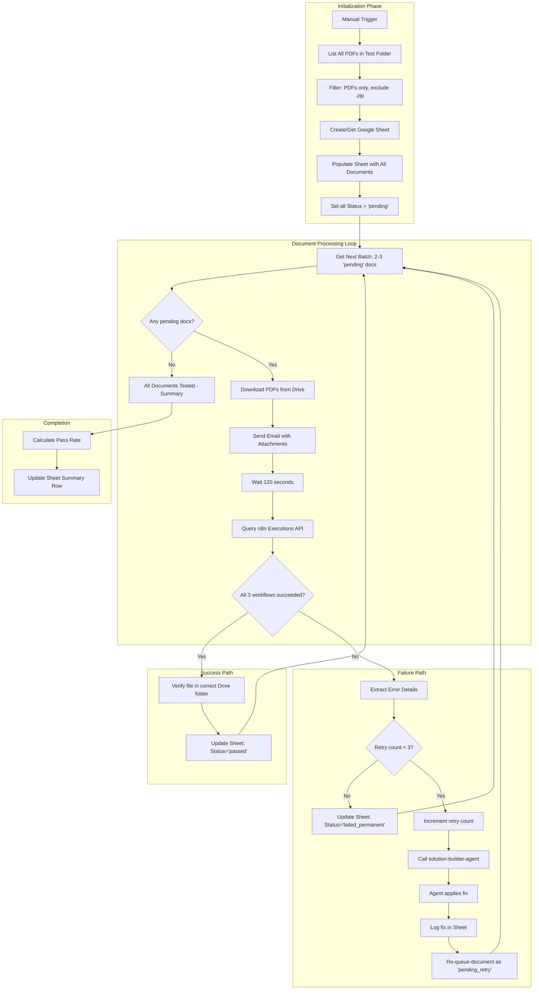

# Solution Brief - Eugene Document Organizer Test Runner V2

## 1. Problem

The current test runner (Workflow ID: UlLHB7tUG0M2Q1ZR) uses iteration-based loops that randomly select documents, leading to:
- Same documents tested multiple times while others are skipped
- No tracking of which documents passed or failed
- Errors detected but not automatically fixed
- No systematic coverage of the 50-100 German real estate test documents

We need a document-based test system that tests ALL documents exactly once, tracks progress, and can self-heal when fixable errors occur.

## 2. Current Process and Pain

- **Random selection**: 3 PDFs selected randomly per iteration, no guarantee of coverage
- **No memory**: System does not know which documents have been tested
- **Manual error handling**: When errors occur, Sway must manually investigate and fix
- **No progress visibility**: Cannot see at a glance how many documents passed/failed
- **Wasted effort**: May test same document 5+ times while missing others entirely

## 3. Requirements

### Inputs
- Google Drive folder (ID: `1-jO4unjKgedFqVqtofR4QEM18xC09Fsk`) containing 50-100 German real estate PDFs
- Document types: Verkaufspreise, Wirtschaftliche Unterlagen, Exposes, Kalkulationen
- Existing Eugene pipeline workflows:
  - Pre-Chunk 0: `YGXWjWcBIk66ArvT`
  - Chunk 2: `qKyqsL64ReMiKpJ4`
  - Chunk 2.5: `okg8wTqLtPUwjQ18`

### Outputs
- Google Sheet tracking all test results (document-by-document)
- Each document classified, filed correctly, and renamed
- Fix history when solution-builder-agent intervenes
- Final pass/fail status for each document

### Integrations
- Google Drive (read test documents, verify output location)
- Google Sheets (progress tracking)
- Gmail (send test emails FROM swayfromthehook@gmail.com TO swayclarkeii@gmail.com)
- n8n API (trigger workflows, query execution status)
- solution-builder-agent (automated fixes via Claude Code)

### Constraints
- Max 2-3 retry attempts per document
- 120-second wait time for pipeline completion
- 15-20 seconds typical processing time per document
- Cannot redesign core workflow logic, only parameter/connection fixes
- Must filter out .zip files (known 403 error source)

## 4. Proposed Workflow

### Overview

A document-driven loop that processes every PDF in the test folder exactly once, tracks results in Google Sheets, and calls solution-builder-agent when fixable errors are detected.

### Architecture Diagram



### Step by Step

**Phase 1: Initialization (runs once at start)**

1. **Manual Trigger** - Start test run manually
2. **List All PDFs** - Google Drive node lists all files in folder `1-jO4unjKgedFqVqtofR4QEM18xC09Fsk`
3. **Filter PDFs** - Remove .zip files and non-PDF items
4. **Create Google Sheet** - New sheet "Eugene Test Run [DATE]" with columns:
   - A: Document Name
   - B: File ID
   - C: Status (pending/testing/passed/failed/failed_permanent)
   - D: Test Date
   - E: Errors Found
   - F: Fix Applied
   - G: Retry Count
   - H: Final Result
   - I: Execution IDs (Pre-Chunk 0, Chunk 2, Chunk 2.5)
5. **Populate Sheet** - Write all document names and File IDs, Status='pending', Retry Count=0

**Phase 2: Document Loop (repeats until all tested)**

6. **Get Next Batch** - Query sheet for up to 3 documents where Status='pending' OR Status='pending_retry'
7. **Check Completion** - If no pending documents, jump to Phase 4
8. **Download PDFs** - Use Google Drive to download the 2-3 selected PDFs
9. **Update Status** - Set Status='testing' in sheet
10. **Send Test Email** - Gmail node sends email:
    - FROM: swayfromthehook@gmail.com
    - TO: swayclarkeii@gmail.com
    - Subject: "Test Doc: [filename]"
    - Attachments: The PDF files
11. **Wait** - 120 second delay for Eugene pipeline
12. **Query Executions** - n8n API call to get execution status for all 3 workflows
13. **Evaluate Results** - Check if Pre-Chunk 0, Chunk 2, Chunk 2.5 all show "success"

**Phase 3a: Success Path**

14. **Verify Output** - Check that file exists in expected Drive folder with correct name
15. **Update Sheet** - Status='passed', record execution IDs, Final Result='PASS'
16. **Continue Loop** - Return to Step 6

**Phase 3b: Failure Path**

17. **Extract Error** - Parse execution error from n8n API response
18. **Check Retry Limit** - If Retry Count >= 3, mark as 'failed_permanent' and continue
19. **Increment Retry** - Retry Count += 1
20. **Call solution-builder-agent** - Send error context, request fix
21. **Log Fix** - Record what fix was applied in column F
22. **Re-queue** - Set Status='pending_retry'
23. **Continue Loop** - Return to Step 6

**Phase 4: Summary**

24. **Calculate Stats** - Count passed, failed, failed_permanent
25. **Write Summary Row** - Add totals at bottom of sheet
26. **End Workflow**

## 5. Architecture Direction (First Pass)

### Internal vs Client
- **Internal** - This is for Sway's own testing infrastructure
- **Account ownership** - Sway owns all accounts (n8n, Google, Gmail)

### Suggested Path
- **n8n workflow** for the main test loop and tracking
- **solution-builder-agent** (Claude Code) called via HTTP webhook when fixes needed

### Why n8n

1. **Complex loop with state** - Document-based iteration with retry logic maps well to n8n's SplitInBatches + Merge patterns
2. **Native Google integrations** - Drive, Sheets, Gmail all have dedicated n8n nodes
3. **HTTP Request flexibility** - Can call n8n API for execution status and trigger solution-builder-agent
4. **Already in ecosystem** - Eugene workflows are n8n, keeping test runner in same platform reduces friction
5. **Self-hosted available** - No per-execution costs for potentially 300+ executions (100 docs x 3 retries)

### Alternative Considered: Pure Claude Code Script

Could write a Python/Node script that Claude Code runs directly. However:
- Would need to manage state externally
- Less visibility into progress
- Harder for Sway to monitor/pause/resume
- n8n provides better operational visibility

**Verdict**: n8n workflow is the right choice.

## 6. Quick Win and Effort

### Quick Win Version (Phase 0)

Build the core loop WITHOUT self-healing first:

- List all documents, populate sheet
- Process documents one-by-one (not batches)
- Record pass/fail status
- Skip retry logic entirely - just mark failures

**Effort**: 1-2 days

**Value**: Immediately see which documents fail, even without auto-fix

### Full Version (Phase 1)

Add self-healing and batching:

- Batch processing (2-3 docs at a time)
- solution-builder-agent integration
- Retry logic with max 3 attempts
- Fix logging

**Effort**: 3-5 days additional

### Rough Effort Class

**Small Project** - 1-2 weeks total for full implementation

### Risks and Open Questions

1. **solution-builder-agent webhook** - Need to design the HTTP interface for triggering fixes
2. **Fix verification** - After agent applies fix, how do we verify it worked before re-testing?
3. **Concurrent execution safety** - If batch of 3 docs sent, need to track which execution belongs to which doc
4. **Gmail sending limits** - 500 emails/day limit should be fine for 100 docs with retries

## 7. Google Sheet Structure

### Sheet Name
`Eugene Test Run - [YYYY-MM-DD]`

### Columns

| Column | Name | Description | Example Values |
|--------|------|-------------|----------------|
| A | Document Name | Original filename | `Verkaufspreis_Musterstr_12.pdf` |
| B | File ID | Google Drive file ID | `1abc123...` |
| C | Status | Current test state | pending, testing, passed, failed, failed_permanent, pending_retry |
| D | Test Date | When last tested | `2024-01-16 14:30:00` |
| E | Errors Found | Error message if failed | `Classification failed: unknown doc type` |
| F | Fix Applied | What solution-builder did | `Updated classifier expression in Chunk 2 node 'Route Document'` |
| G | Retry Count | Number of attempts | 0, 1, 2, 3 |
| H | Final Result | End state | PASS, FAIL, SKIPPED |
| I | Execution IDs | All 3 workflow execution IDs | `exec_123, exec_124, exec_125` |

### Initial Population Query

```
Google Drive: List files in folder 1-jO4unjKgedFqVqtofR4QEM18xC09Fsk
Filter: mimeType = 'application/pdf'
For each file:
  - Document Name = file.name
  - File ID = file.id
  - Status = 'pending'
  - Retry Count = 0
  - All other columns = empty
```

## 8. State Management Approach

### Why Google Sheets Works

- **Persistent state** - Survives workflow restarts
- **Human readable** - Sway can open sheet and see progress
- **Query-able** - Can filter for pending/failed documents
- **Audit trail** - Fix history preserved

### State Transitions

```
pending --> testing --> passed
                   --> failed --> pending_retry --> testing --> ...
                             --> failed_permanent (after 3 retries)
```

### Batch Tracking

When processing batch of 2-3 documents:
1. Mark all as 'testing' immediately
2. After 120s, query n8n for executions in that time window
3. Match executions to documents by:
   - Email subject contains filename
   - Or track via execution metadata

**Simpler alternative for Phase 0**: Process one document at a time. Slower but eliminates correlation complexity.

## 9. Error Handling and Retry Logic

### Error Categories

| Error Type | Auto-Fixable? | Fix Approach |
|------------|---------------|--------------|
| Classification failure | Sometimes | Adjust classifier expressions |
| Drive permission error | Rarely | Check folder permissions, may need manual fix |
| Missing field value | Sometimes | Add default value or fix expression |
| Incorrect folder routing | Yes | Fix routing logic in workflow |
| Timeout | Retry only | Just retry, no fix needed |
| .zip file error | No | Skip document (filter in Phase 1) |

### Retry Logic

```
on_failure:
  if retry_count >= 3:
    status = 'failed_permanent'
    final_result = 'FAIL'
  else:
    retry_count += 1
    call solution-builder-agent with:
      - workflow_id (which workflow failed)
      - execution_id (for error details)
      - error_message
      - document_name (for context)
    log fix_applied
    status = 'pending_retry'
```

### solution-builder-agent Integration

**Trigger**: HTTP webhook POST to Claude Code session

**Payload**:
```json
{
  "task": "fix_eugene_workflow_error",
  "workflow_id": "qKyqsL64ReMiKpJ4",
  "execution_id": "exec_12345",
  "error_message": "Cannot read property 'classification' of undefined",
  "document_name": "Verkaufspreis_Muster.pdf",
  "context": "Document classification step failed"
}
```

**Expected Response**:
```json
{
  "fix_applied": true,
  "fix_description": "Added null check to classification expression in node 'Route Document'",
  "workflow_updated": true
}
```

## 10. Next Steps

1. **Run architecture-feasibility-agent** to validate:
   - Gmail sending approach (attachment handling)
   - n8n execution correlation method
   - solution-builder-agent HTTP interface design

2. **Build Phase 0** (Quick Win):
   - Create test workflow with single-document processing
   - No retry logic, just pass/fail tracking
   - Validate basic flow works

3. **Extend to Phase 1**:
   - Add batching
   - Integrate solution-builder-agent
   - Add retry logic

4. **Launch solution-builder-agent** when ready to implement

---

**Brief created**: 2024-01-16
**Author**: idea-architect-agent
**Status**: Ready for feasibility review or direct build
