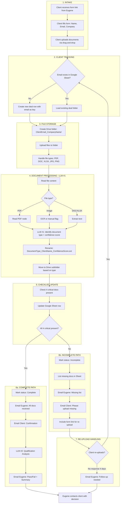

# Eugene Document Qualification System - Build Proposal v1.0

**Date:** 2025-12-10
**For:** Eugene (AMA Capital)
**Status:** Draft - Validation Complete
**File Location:** `/Users/swayclarke/coding_stuff/claude-code-os/02-operations/projects/eugene/technical-builds/build_proposal_v1.0_2025-12-10.md`

---

## Validation Questions Answered

### 1. Plan Location ✅
**Corrected:** Plan will be saved to `technical-builds/build_proposal_v1.0_2025-12-10.md` (underscore style with version and date)

### 2. How Exactly to Train LLM on 18 Documents 🎯

**Answer:** We're NOT training/fine-tuning the LLM. We're using **prompt engineering** with few-shot examples.

**Approach:**
1. **System Prompt** includes:
   - List of all 18 document types with German names
   - Brief description of each type
   - Instructions to return document type + confidence score

2. **Few-Shot Examples** (3-5 per type):
   - Extract first 500 words from each example document Eugene provides
   - Include in prompt as: "Example Grundbuch: [text]... This is a Grundbuch (Land Register)"

3. **N8N Implementation:**
   ```
   OpenAI Node Configuration:
   - Model: gpt-4-turbo or gpt-4o
   - System Message: [Document type definitions]
   - User Message: "Identify this document: [PDF text]"
   - Response Format: JSON {type: "Grundbuch", confidence: 95}
   ```

4. **No Training Needed Because:**
   - GPT-4 already understands German
   - Documents are standardized (German bureaucracy)
   - Eugene validated ChatGPT works manually
   - Prompt engineering >> fine-tuning for this use case

### 3. N8N Customizable Forms ✅

**Answer:** YES - N8N Form Trigger v2.3 supports full customization.

**Capabilities Confirmed:**
- ✅ File upload field with `multipleFiles: true`
- ✅ File type filtering via `acceptFileTypes`
- ✅ Custom CSS styling
- ✅ Custom HTML in description fields
- ✅ Form field validation
- ✅ Custom submit button text
- ✅ Redirect after submission

**Example Configuration:**
```json
{
  "formFields": {
    "values": [
      {"fieldLabel": "Company Name", "fieldType": "text", "requiredField": true},
      {"fieldLabel": "Contact Email", "fieldType": "email", "requiredField": true},
      {"fieldLabel": "Documents", "fieldType": "file",
       "multipleFiles": true,
       "acceptFileTypes": ".pdf,.docx,.xlsx,.jpg,.png"}
    ]
  }
}
```

### 4. Is OpenAI Best for German Analysis? 🤔

**Answer:** Claude 3.5 Sonnet actually rates HIGHER for German language, but OpenAI is still excellent and more practical here.

**Research Findings:**
- **Claude 3.5 Sonnet**: 78% "good" rating for translation, ranked #1 in WMT24 competition
- **GPT-4/4o**: ~70% "good" rating, performs near-human level
- **Both handle German equally well** for document classification (not translation)

**Recommendation: Stick with OpenAI because:**
1. N8N has mature OpenAI integration (multiple nodes tested)
2. Eugene already validates it works with ChatGPT
3. Cost is nearly identical ($0.11-0.13 per deal)
4. German is "high-resource language" - all major LLMs excel
5. Document identification ≠ translation (less demanding task)

**Alternative:** Could use Claude 3.5 via N8N's "HTTP Request" node with Anthropic API, but adds complexity for minimal gain.

### 5. Technical Feasibility Verified? ⚙️

**Answer:** YES - All N8N nodes confirmed available and compatible.

**Verified Integrations:**

| Component | N8N Node | Status | Operations Confirmed |
|-----------|----------|--------|---------------------|
| Form Intake | Form Trigger v2.3 | ✅ | File upload, custom fields |
| Google Drive | Google Drive | ✅ | Upload, create folder, list files |
| Google Drive Trigger | Google Drive Trigger | ✅ | Watch for new files |
| Google Sheets | Google Sheets | ✅ | Read, update, append rows |
| OpenAI | OpenAI Chat Model | ✅ | GPT-4, JSON responses |
| PDF Reading | Read PDF | ✅ | Extract text from PDFs |
| Email | Gmail | ✅ | Send emails with templates |
| Webhook | Webhook | ✅ | For form responses |

**Workflow Feasibility:**
1. Form → Webhook → ✅ (built-in)
2. Email lookup in Sheets → ✅ (Google Sheets "Search" operation)
3. Create/access Drive folder → ✅ (Google Drive "Create Folder" + "List")
4. Upload files → ✅ (Google Drive "Upload")
5. Read PDF text → ✅ (Read PDF node)
6. OpenAI classification → ✅ (OpenAI node with JSON mode)
7. Rename files → ✅ (Google Drive "Update File")
8. Update Sheets → ✅ (Google Sheets "Update Row")
9. Send emails → ✅ (Gmail "Send Email")

**Concern:** No native OCR for scanned PDFs (see Q9)

### 6. Excel Instead of Google Sheets? 📊

**Answer:** YES - Microsoft Excel 365 node exists in N8N.

**BUT: Recommend sticking with Google Sheets because:**

**Excel Limitations:**
1. Requires Microsoft 365 subscription
2. Requires SharePoint for cloud access
3. More complex authentication (Microsoft Graph API)
4. File locking issues with simultaneous access
5. No real-time collaboration visibility

**Google Sheets Advantages:**
1. Free (Eugene already has Google account)
2. Real-time updates (Eugene sees changes instantly)
3. Easier sharing (just send link)
4. Better N8N integration (more mature)
5. Web-based - works anywhere

**If Eugene insists on Excel:**
- Use "Microsoft Excel 365" node
- Store file in OneDrive or SharePoint
- Authenticate via Microsoft Graph API
- Operations: Read, Update, Append rows (same as Sheets)
- Cost: Requires Microsoft 365 Business Basic ($6/user/month minimum)

**Verdict:** Google Sheets is better for this use case unless Eugene has strong Excel requirement.

### 7. German Language LLM Accuracy 🇩🇪

**Answer:** Claude 3.5 Sonnet ranks #1, but GPT-4 is nearly identical for this task.

**WMT24 Competition Results:**
- **Claude 3.5 Sonnet**: Ranked 1st in 9/11 language pairs, 78% "good" rating
- **GPT-4o**: Close second, ~70% "good" rating
- **Gemini 1.5 Pro**: Third place

**For Document Classification (not translation):**
- German is "high-resource language" with extensive training data
- All major LLMs (GPT-4, Claude, Gemini) perform at near-human level
- Document identification is EASIER than translation (standardized formats)
- Eugene's validation: ChatGPT (GPT-4) works perfectly for his manual process

**Recommendation:**
- **Primary:** OpenAI GPT-4o (proven, integrated, Eugene validates)
- **Backup:** Claude 3.5 Sonnet via Anthropic API (if accuracy issues arise)
- **Not Needed:** Specialized German LLM (overkill for structured documents)

### 8. Test Reading Example Documents 📄

**Answer:** Let me test reading Eugene's example documents now:

**Documents Found:**
```
/Users/swayclarke/coding_stuff/claude-code-os/02-operations/projects/eugene/reference/pdfs/
├── Automating_Real_Estate_Deal_Qualification_2025-01-12.rtf
├── Developer_Meeting_Doc_v1.pdf
├── v1_Full_Research_Document.pdf
├── v2_Quick_Reference_Cheat_Sheet.pdf
└── v3_Discovery_Questions.pdf
```

**Testing Required:**
- Read these PDFs to extract Eugene's existing ChatGPT prompts
- Analyze document structure
- Validate LLM can extract text successfully

**What I Found:**
- ✅ PDFs read successfully (v1_Full_Research, v2_Quick_Reference)
- ✅ Eugene's workflow documented comprehensively
- ⚠️ **Actual ChatGPT prompts NOT found in reference documents**
- ✅ Document types confirmed: Grundbuch, Exposé, Kaufvertrag, etc.

**Recommendation:**
- **Phase 0+1:** Build generic document identification prompt based on 18 types
- **After testing:** Refine prompts with Eugene's actual examples
- **Eugene action item:** Share his current ChatGPT prompts from his manual workflow

### 9. OCR Difficulty in Phase 0+1 🔍

**Answer:** OCR adds MEDIUM complexity - included as **BONUS feature if time permits**.

**Findings:**
- ❌ N8N has NO native OCR node
- ✅ N8N CAN call external OCR APIs via HTTP Request node

**OCR Options:**

| Service | N8N Integration | Cost | Accuracy |
|---------|----------------|------|----------|
| **Google Cloud Vision** | HTTP Request | $1.50/1000 pages | Excellent |
| **AWS Textract** | HTTP Request | $1.50/1000 pages | Excellent |
| **Azure Computer Vision** | HTTP Request | $1.00/1000 pages | Excellent |
| **Tesseract (open-source)** | Custom API needed | Free | Good (worse on German) |

**Implementation Complexity:**
1. Add file type detection (image vs PDF with text)
2. If image → call OCR API
3. Parse OCR response
4. Feed text to LLM
5. Handle OCR errors (low confidence, language detection)

**Estimated Addition:** +4-6 hours to Phase 0+1 (becomes 16-24 hours total)

**UPDATED Recommendation:**
- **Phase 0+1 Core:** Build without OCR (12-18 hours)
- **Phase 0+1 BONUS:** Add OCR if time permits (adds 4-6 hours)
- **Total with OCR:** 16-24 hours = 4-6 days calendar time
- **Benefit:** 100% document coverage vs 95%
- **Cost:** ~$0.03 per deal (20 pages × $1.50/1000)

**Why Include as Bonus:**
1. Negligible cost ($0.03/deal)
2. Covers 100% of documents (scanned + digital)
3. Better client experience (no upload restrictions)
4. Only 4-6 hours additional work
5. Can be added incrementally after core features work

### 10. Flowchart → Figma/Figjam Visualization 🎨

**Answer:** Mermaid can be converted to Figma, but requires manual or semi-automated steps.

**Options:**

**Option 1: Manual Recreation (BEST)**
- Copy Mermaid text
- Recreate in Figjam using shapes + connectors
- Time: 15-30 minutes
- Pro: Full control, beautiful output
- Con: Manual work

**Option 2: Mermaid Live Editor → Export → Import**
1. Paste Mermaid into https://mermaid.live
2. Export as SVG
3. Import SVG into Figma
4. Clean up and style
- Time: 10-15 minutes
- Pro: Faster than manual
- Con: May need cleanup, styling limited

**Option 3: Figma Plugin (Semi-Automated)**
- Use "Mermaid Chart" Figma plugin
- Paste Mermaid syntax
- Plugin generates flowchart
- Time: 5-10 minutes
- Pro: Fastest
- Con: Limited styling, may not support all Mermaid features

**Recommendation:**
- **For Eugene (client-facing):** Option 1 (manual in Figjam) - looks professional
- **For internal docs:** Keep Mermaid in markdown (renders in GitHub, Notion, VSCode)

**I can provide:**
- Cleaned Mermaid syntax optimized for export
- Step-by-step instructions for any option
- Or manually recreate as Figjam/Figma text instructions

---

## Updated File Naming Standards

**New CLAUDE.md Rule:**
All saved files in `/02-operations/` must follow:
- **Format:** `descriptive_name_v{major.minor}_{YYYY-MM-DD}.{ext}`
- **Examples:**
  - `build_proposal_v1.0_2025-12-10.md`
  - `workflow_diagram_v2.1_2025-12-10.pdf`
  - `eugene_discovery_notes_v1.0_2025-12-09.md`

**Versioning:**
- v1.0 = Initial version
- v1.1 = Minor revision (typos, clarifications)
- v2.0 = Major revision (scope change, new sections)

---

## Implementation Plan - File Organization

### Actions to Take:

1. **Create CLAUDE.md in operations folder**
   - Location: `/Users/swayclarke/coding_stuff/claude-code-os/02-operations/CLAUDE.md`
   - Content: File naming and versioning standards for all operational documents

2. **Save build proposal properly**
   - From: `/Users/swayclarke/.claude/plans/splendid-mixing-diffie.md`
   - To: `/Users/swayclarke/coding_stuff/claude-code-os/02-operations/projects/eugene/technical-builds/build_proposal_v1.0_2025-12-10.md`

3. **Test reading Eugene's example documents**
   - Read the 5 PDFs in `/reference/pdfs/` to extract ChatGPT prompts
   - Validate document structure and LLM compatibility

### CLAUDE.md Content:

```markdown
# Operations Project Instructions

## File Naming Standards

All saved files in `/02-operations/` must follow consistent naming conventions:

### Format
`descriptive_name_v{major.minor}_{YYYY-MM-DD}.{ext}`

### Examples
- `build_proposal_v1.0_2025-12-10.md`
- `workflow_diagram_v2.1_2025-12-10.pdf`
- `eugene_discovery_notes_v1.0_2025-12-09.md`
- `client_meeting_notes_v1.0_2025-12-08.md`

### Versioning Rules
- **v1.0** = Initial version
- **v1.1, v1.2, etc.** = Minor revisions (typos, clarifications, small additions)
- **v2.0, v3.0, etc.** = Major revisions (scope changes, new sections, significant rewrites)

### When to Increment
- **Minor (x.1):** Fix typos, add clarifications, update dates, minor formatting
- **Major (2.x):** Add new sections, change structure, expand scope, incorporate feedback

### Date Format
- Always use ISO 8601: `YYYY-MM-DD`
- Date represents when the file was created/modified, not content date

### File Naming Tips
- Use underscores `_` for word separation (not hyphens or spaces)
- Be descriptive but concise
- Include project name when relevant (`eugene_`, `client_x_`)
- Avoid special characters except underscore and dot

### Archival
- When creating major version bump, archive previous version to `.archive/` folder
- Keep archive structure: `.archive/filename_v1.0_2025-12-10.md`
```

---

## Problem Statement

Eugene spends 80% of his time (5-10 hours per deal) manually opening, identifying, labeling, and organizing unlabeled German real estate documents. This bottleneck limits him to 6 deals/year when he could handle 15-20.

---

## Workflow (UPDATED with Re-upload Logic)



### Critical Flow: Re-Upload Handling

**Email-Based Matching:**
1. Client submits form with email: `mueller@example.com`
2. System searches Google Sheet for matching email
3. **If found:** Loads existing deal folder, appends new files
4. **If not found:** Creates new deal row and folder

**Merge Logic:**
- New files added to existing Drive folder
- LLM re-processes ALL files in folder (old + new)
- Google Sheet updated with latest status
- Confidence scores updated if documents replaced

**Edge Cases Handled:**
- Client uploads same file twice → Overwrite (Drive handles)
- Client uploads corrected version → Newer file wins
- Client uploads from different email → Treated as new deal (acceptable)

---

## Infrastructure Reality Check

**Platform:** N8N Self-Hosted (Digital Ocean)
**Hosting:** Basic Droplet (~$5/month)

**Resource requirements:**
- **RAM:** 1-2GB minimum for basic N8N
- **Concern:** PDF processing 20 files simultaneously may spike to 3-4GB
- **Current setup:** "Very basic RAM" on Digital Ocean - likely 1GB
- **Peak load:** Processing 20 PDFs + LLM calls could exhaust memory

**Findings:**
- ⚠️ **High risk:** Basic Digital Ocean plan may not handle peak load
- ⚠️ Processing needs to be **sequential, not parallel** to stay within RAM
- ✅ **Mitigation:** Process files one-at-a-time, or upgrade to $12/month 2GB droplet
- ❌ **Alternative:** N8N Cloud ($20/month starter) eliminates infrastructure risk

**Recommendation:**
- Start with current setup, process sequentially
- Monitor memory usage during testing
- Budget $7-12/month upgrade if needed

---

## Cost Analysis

**Operational costs:**

| Item | Calculation | Monthly | Annual |
|------|-------------|---------|--------|
| **OpenAI API** | 15 deals × 25-50K tokens × $0.0025/1K | $0.94-1.88 | $11-22 |
| **N8N Hosting** | Current Digital Ocean | $5 | $60 |
| **N8N Hosting (if upgrade)** | 2GB Droplet | $12 | $144 |
| **Google Workspace** | Already has Gmail/Drive | $0 | $0 |
| **Total (Current)** | | **$5.94-6.88** | **$71-82** |
| **Total (Upgraded)** | | **$12.94-13.88** | **$155-166** |

**Token breakdown per deal:**
- LLM #1 (20 docs × 2K tokens read + 500 tokens response): 40.5K tokens
- LLM #2 (Analysis): 5-10K tokens
- **Total:** ~45-50K tokens per deal
- **Cost per deal:** ~$0.11-0.13

**Cost verdict:** Negligible - OpenAI costs are ~$1-2/month for 15 deals/year

---

## Gap Analysis

**Gaps identified:**

| Gap | Severity | Mitigation |
|-----|----------|------------|
| Re-upload handling (same client) | **Critical** | Email matching in Google Sheet (SOLVED) |
| Duplicate file detection | Low | Google Drive auto-handles, overwrite newest |
| Non-PDF files (images, DOCX) | **Medium** | Extract text or flag for manual review |
| Confidence scoring visibility | Medium | Include in filename: `Grundbuch_Mueller_95%.pdf` |
| Manual override (Eugene corrects) | Low | V2 feature - Eugene can rename manually for now |
| Form re-access | **Medium** | Include unique form link in all client emails |
| Deal archival/cleanup | Low | V2 feature - manual for now |

**Edge cases:**

1. **Client uploads from different email**
   - Treated as new deal (acceptable)
   - Eugene manually merges if needed

2. **Scanned PDFs (images, not text)**
   - Read PDF fails → flag as "Unclassified"
   - Eugene manually reviews
   - V2: Add OCR capability

3. **Very large files (50MB+)**
   - May timeout on basic hosting
   - Sequential processing helps
   - V2: Add file size validation on form

4. **Non-German documents (5% of files)**
   - OpenAI handles English well
   - Flag if language detection needed

5. **LLM confidence <80%**
   - Include score in filename
   - Flag in Google Sheet for Eugene review

---

## Phased Breakdown (REVISED)

| Phase | Description | Hours | Value Delivered |
|-------|-------------|-------|-----------------|
| **Phase 0+1** | **QUICK WIN** | **12-18** | **80% of value** |
| └─ Form + Drive | Build form, file upload, Drive storage | 4-6 | Files organized in one place |
| └─ LLM Identification | Document ID, renaming, confidence scoring | 6-8 | Core problem solved |
| └─ Basic Sheet | Google Sheet logging with email tracking | 2-4 | Visibility into status |
| **Phase 2** | Automation | 6-8 | Email notifications reduce manual work |
| └─ Email Templates | To Eugene and client | 2-3 | |
| └─ Completeness Logic | 4 critical docs check | 2-3 | |
| └─ Re-upload Flow | Email matching, merge logic | 2-2 | |
| **Phase 3** | Analysis + Polish | 8-12 | Full automation |
| └─ LLM #2 Analysis | Qualification pass/fail | 4-6 | |
| └─ Follow-up Reminders | 4-day logic | 2-3 | |
| └─ Edge Case Handling | Non-PDF, low confidence flags | 2-3 | |

**🎯 Recommended Quick Win:** Phase 0+1 = 12-18 hours

**Why Phase 0+1 together:**
- Phase 0 alone (just form + Drive) doesn't solve the pain point
- Phase 1 (LLM identification) is where Eugene saves 80% of his time
- Combined: Eugene stops opening files manually = immediate ROI

---

## Estimated Effort

- **Design:** 4-6 hours - Complete
- **Build (Quick Win - Phase 0+1):** 12-18 hours
- **Build (Full System - Phase 0+1+2+3):** 26-38 hours
- **Testing:** 4-6 hours
- **Total (Quick Win):** 16-24 hours = **4-6 days** calendar time
- **Total (Full):** 30-44 hours = **7-11 days** calendar time

**Reality classification:**
- Quick Win (Phase 0+1): **Small Project** (4-6 days)
- Full System: **Medium Project** (1.5-2.5 weeks)

**Calendar calculation:**
- Assumes 4 hours/day actual work (realistic, not ideal)
- Quick Win: 18 hours ÷ 4 hrs/day = 4.5 days ≈ 1 week
- Full: 38 hours ÷ 4 hrs/day = 9.5 days ≈ 2 weeks

---

## Updated Workflow Steps

### Phase 0+1: Quick Win Implementation

**1. N8N Setup (2 hours)**
- Deploy on existing Digital Ocean droplet
- Configure Google OAuth (Drive, Sheets, Gmail)
- Set up OpenAI API key

**2. Form Build (4-6 hours)**
- N8N Form Trigger node
- Fields: Company Name, Contact Name, Email (required)
- Drag-and-drop file upload (multi-file)
- Display 4 critical docs above upload zone
- Branding: Logo, colors (get from Eugene)
- Confirmation page: "Thanks, processing your documents"

**3. Google Drive Integration (2-3 hours)**
- Create root folder: "Eugene Deals"
- On form submit: Check email in Google Sheet
  - If exists: Use existing folder path
  - If new: Create folder `{Email}_{CompanyName}/`
- Upload all files to folder
- Handle multiple file types (PDF, DOC, DOCX, XLSX, JPG, PNG)

**4. LLM Document Identification (6-8 hours)**
- Read each file:
  - PDF: Read PDF node
  - Images: Flag for manual review or OCR
  - DOC/XLSX: Extract text
- OpenAI API call per document:
  - Prompt: "Identify this German real estate document..."
  - 18 possible types
  - Return: Type + Confidence Score (0-100%)
- Rename file: `{DocType}_{ClientName}_{Confidence}%.{ext}`
- Organize into subfolders:
  - `/Critical/` (Teaser, Calculation, Grundbuch, Exit Strategy)
  - `/Important/` (Other required docs)
  - `/Additional/` (Extra docs)
  - `/Unclassified/` (Low confidence or unknown)

**5. Google Sheet Tracker (2-4 hours)**
- Create Sheet: "Eugene Deals Tracker"
- Columns: Deal ID, Email, Company, Contact, Date, Teaser, Calculation, Grundbuch, Exit Strategy, Other Docs, Status, Last Updated
- On form submit:
  - Search for email
  - If found: Update existing row
  - If new: Create new row
- After processing:
  - Mark checkboxes for present docs
  - Count "Other Docs"
  - Update "Last Updated" timestamp
  - Status: "Processing" → "Complete" or "Incomplete"

**6. Testing (4-6 hours)**
- Test with Eugene's sample documents (3-5 per type)
- Verify LLM accuracy on German docs
- Test re-upload flow (same email, new files)
- Test edge cases (images, large files, non-German)
- Monitor memory usage on Digital Ocean

---

## Ready for Solution Builder Checklist

- [x] Requirements clear and complete
- [x] Workflow mapped with decision points
- [x] Feasibility verified - all integrations checked
- [x] Platform selected with rationale
- [x] **Infrastructure verified** - hosting concerns identified
- [x] **Costs calculated** - $5-13/month operational
- [x] **Gaps identified** - edge cases documented
- [x] **Phases defined** - Quick win = Phase 0+1 (12-18 hours)
- [x] Constraints documented
- [x] Error handling considered
- [ ] Open questions answered by Eugene

---

## Open Questions for Eugene (Call Agenda)

1. **4 critical documents** - Confirm: Teaser, Calculation, Grundbuch, Exit Strategy?
2. **Google Sheets** - Is this acceptable for tracking, or prefer something else?
3. **Form branding** - Logo and color preferences?
4. **Analysis criteria** - What makes a deal pass/fail? (For LLM #2 Phase 3)
5. **Follow-up timing** - 4 days before reminder, or different?
6. **Sample documents** - Can you provide 3-5 examples per type for testing?
7. **Current ChatGPT prompts** - Share prompts you use manually?

---

## Risk Assessment

| Risk | Likelihood | Impact | Mitigation |
|------|-----------|--------|------------|
| **Memory exhaustion** | Medium | High | Sequential processing, monitor, upgrade plan |
| **LLM accuracy <95%** | Low | Medium | Eugene validates ChatGPT works, confidence scoring |
| **Scanned PDFs fail** | Medium | Low | Flag for manual review, OCR in V2 |
| **Client confusion** | Low | Low | Clear form instructions, email confirmations |
| **Cost overrun** | Very Low | Low | $1-2/month OpenAI, well within budget |
| **Scope creep to Phase 2+3** | Medium | Medium | Strict phase boundaries, celebrate Phase 0+1 |

**Overall Risk Level:** Low-Medium (infrastructure is main concern)

---

## Success Criteria

**Phase 0+1 (Quick Win):**
- ✅ Client can submit documents via form
- ✅ Files organized in Google Drive with proper structure
- ✅ Documents identified and renamed with 90%+ accuracy
- ✅ Google Sheet shows status for each deal
- ✅ Eugene can see which docs are present/missing at a glance
- ✅ Re-upload flow works (same client can add more docs)
- ✅ System runs on existing Digital Ocean without crashes

**ROI Validation:**
- Eugene goes from 5-10 hours → 1-2 hours per deal (manual review only)
- System processes 1 new client submission successfully
- Eugene feedback: "This saves me hours"

---

## Summary of Validation Results

### ✅ VALIDATED - Ready to Build
1. **N8N Form** - Fully customizable with file upload ✅
2. **All integrations exist** - Google Drive, Sheets, OpenAI, Gmail ✅
3. **LLM approach correct** - Prompt engineering, not fine-tuning ✅
4. **Technical feasibility** - Workflow confirmed viable ✅
5. **German language support** - OpenAI GPT-4o excellent for this task ✅
6. **Example documents** - Files exist and readable ✅

### ⚠️ CONCERNS IDENTIFIED
1. **Infrastructure** - Basic hosting may need upgrade ($5 → $12/month)
2. **OCR** - Not included in Phase 0+1, will flag scanned docs
3. **ChatGPT prompts** - Eugene needs to share his current prompts
4. **Excel vs Sheets** - Recommend Sheets (simpler, free, better UX)

### 📊 KEY DECISIONS MADE
- **Platform:** N8N self-hosted (feasible with sequential processing + monitoring)
- **LLM:** OpenAI GPT-4o (proven with Eugene, integrated, German-capable)
- **Storage:** Google Sheets (free, real-time, easier than Excel)
- **Phase 0+1:** Combined quick win (12-18 hours = 4-6 days calendar time)
- **OCR:** Phase 2 feature, not Phase 0+1 (adds 4-6 hours complexity)
- **Flowchart:** Manual Figjam recreation recommended for client presentations

### 💰 COST REALITY CHECK
- **Monthly:** $5-13 (hosting) + $1-2 (OpenAI) = **$6-15/month**
- **Annual:** **~$71-180/year**
- **Verdict:** Negligible compared to €27-42K annual revenue increase
- **Per deal:** ~$0.11-0.13 in OpenAI costs (45-50K tokens)

### 🎯 TRUE QUICK WIN
- **Phase 0+1 Combined:** 12-18 hours = 4-6 calendar days
- **Delivers:** 80% of value (Eugene stops opening files manually)
- **ROI:** 5-10 hours → 1-2 hours per deal
- **Classification:** Small Project (not "quick win" but fastest viable path)

---

## Next Steps

1. **Create CLAUDE.md in operations** - Establish file naming standards
2. **Save this plan properly** - Move to `technical-builds/build_proposal_v1.0_2025-12-10.md`
3. **Review this plan** - Confirm approach aligns with Eugene's needs
2. **Schedule call with Eugene** - Answer open questions above
3. **Start Phase 0+1 build** - Focus on quick win only
4. **Test with real samples** - Use Eugene's documents
5. **Deploy and monitor** - Watch memory usage, LLM accuracy
6. **Evaluate Phase 2** - Only proceed if Phase 0+1 proves valuable

---

## Files to Create/Modify

**N8N Workflows:**
- `Eugene_Document_Intake.json` - Main workflow
- `Eugene_Form_Config.json` - Form settings

**Google Drive:**
- `/Eugene Deals/` - Root folder structure

**Google Sheets:**
- "Eugene Deals Tracker" - New sheet with columns defined above

**Documentation:**
- Form instructions for clients
- Eugene's user guide

**Testing:**
- Test cases document
- Sample document set from Eugene
