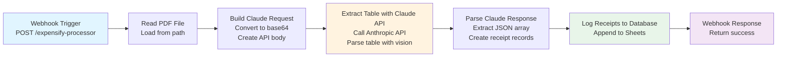

# W6 v2: Expensify Table Extractor - Workflow Diagram

## Visual Flow



## Node Flow with Data

```
INPUT (Webhook POST):
{
  "pdf_path": "/path/to/expensify.pdf",
  "report_month": "Dec2025"
}
    ↓
[1] Read PDF File
    → Binary PDF data loaded
    ↓
[2] Build Claude Request
    → PDF converted to base64
    → API request body created:
      {
        model: "claude-3-5-sonnet-20241022",
        messages: [
          {text: "Extract table..."},
          {image: base64_pdf_data}
        ]
      }
    ↓
[3] Extract Table with Claude API
    → POST to https://api.anthropic.com/v1/messages
    → Claude Vision API parses PDF table
    → Returns: {content: [{text: "[{date:'...', merchant:'...', amount:...}]"}]}
    ↓
[4] Parse Claude Response
    → Extracts JSON array from response text
    → Creates receipt records:
      [
        {ReceiptID: "EXP_Dec2025_01", Vendor: "Amazon", Amount: 25.50, ...},
        {ReceiptID: "EXP_Dec2025_02", Vendor: "Uber", Amount: 15.00, ...},
        ...
      ]
    ↓
[5] Log Receipts to Database
    → Appends to Google Sheets "Receipts" tab
    → Auto-maps columns: ReceiptID, Vendor, Amount, Date, Currency, Source, Notes
    ↓
[6] Webhook Response
    → Returns success message to caller
```

## Error Handling Flow

```
Any Node Error
    ↓
[Webhook Trigger has onError: continueRegularOutput]
    ↓
[Error details logged to execution]
    ↓
[Webhook Response returns error message]
```

## Comparison to W2 Integration

**Shared Pattern (Claude API):**
```
W2: Gmail Receipt → Binary Image → Build Request → Claude API → Parse Response → Log to Sheets
W6: Webhook PDF → Binary PDF → Build Request → Claude API → Parse Response → Log to Sheets
                     ↑____________________________________________↑
                     SAME: HTTP Request node configuration from W2
```

**Key Difference:**
- W2: Extracts text from single receipt image
- W6: Extracts structured table from multi-row PDF summary

## Data Structure

**Input (Webhook):**
```json
{
  "pdf_path": "/path/to/file.pdf",
  "report_month": "Dec2025"
}
```

**Claude Response (text):**
```json
[
  {"date": "2025-12-01", "merchant": "Amazon", "amount": 25.50, "currency": "EUR"},
  {"date": "2025-12-03", "merchant": "Uber", "amount": 15.00, "currency": "EUR"},
  {"date": "2025-12-05", "merchant": "Starbucks", "amount": 5.80, "currency": "EUR"}
]
```

**Output (Google Sheets):**
```
| ReceiptID        | Vendor    | Amount | Date       | Currency | Source    | FileID | Notes                          |
|------------------|-----------|--------|------------|----------|-----------|--------|--------------------------------|
| EXP_Dec2025_01   | Amazon    | 25.50  | 2025-12-01 | EUR      | Expensify |        | From Dec2025 Expensify report  |
| EXP_Dec2025_02   | Uber      | 15.00  | 2025-12-03 | EUR      | Expensify |        | From Dec2025 Expensify report  |
| EXP_Dec2025_03   | Starbucks | 5.80   | 2025-12-05 | EUR      | Expensify |        | From Dec2025 Expensify report  |
```

## Workflow Characteristics

- **Node Count:** 7 nodes (simple, linear)
- **External APIs:** 1 (Anthropic Claude)
- **Google Services:** 1 (Sheets)
- **Triggers:** 1 (Webhook)
- **Branching:** None (linear flow)
- **Error Handling:** Webhook-level (continueRegularOutput)
- **Token Usage:** ~4K tokens per execution (Claude Vision API)
- **Execution Time:** ~5-10 seconds (depends on PDF size)

## Testing Checklist

- [ ] Webhook accepts POST with pdf_path and report_month
- [ ] PDF file is read successfully
- [ ] PDF is converted to base64
- [ ] Claude API returns JSON array
- [ ] JSON is parsed correctly
- [ ] ReceiptIDs are generated in correct format (EXP_{month}_{index})
- [ ] All fields mapped to Google Sheets columns
- [ ] Multiple transactions logged (not just first one)
- [ ] Webhook returns success response

---

**Workflow ID:** zFdAi3H5LFFbqusX
**Created:** 2026-01-28
**Builder:** solution-builder-agent
