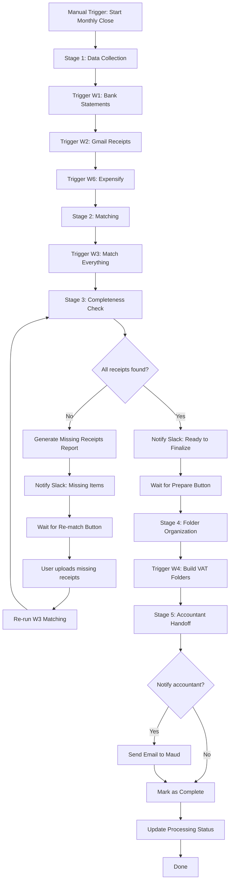

# Solution Brief – W0 Expense System Master Orchestrator

## 1. Problem

Sway needs to process monthly/quarterly expenses for accounting with minimal manual intervention. Current process requires:
- Running 8 separate workflows manually
- Tracking which receipts are missing
- Organizing files into monthly folders
- Coordinating with accountant

This is time-consuming and error-prone.

## 2. Current process and pain

**Manual steps today:**
- Upload bank statements → trigger W1
- Wait for Gmail polling (W2) and background monitors (W7, W8)
- Run matching (W3) manually
- Check for missing receipts manually
- Upload missing items
- Re-run matching
- Run folder builder (W4)
- Email accountant

**Pain points:**
- Too many manual triggers
- No visibility into what's missing
- No structured handoff to accountant
- Risk of forgetting steps

## 3. Requirements

### Inputs
- Bank statement PDFs (uploaded to Bank-Statements folder)
- Gmail receipts (collected by W2)
- Expensify reports (processed by W6)
- G Drive invoices (collected by W8)
- Downloads folder receipts (collected by W7)
- Manual trigger from Sway (webhook or n8n form)

### Outputs
- Missing receipts report (Google Sheets tab)
- Slack notifications with actionable links
- Organized monthly VAT folders
- Email notification to accountant (optional)
- Processing status tracking (Google Sheets)

### Integrations
- n8n (workflow orchestration)
- Google Sheets (1l1uA8qA0DCGzGLBhmP2HqTzaajjbkURY2SLeqSuHMXM)
- Google Drive (VAT folders)
- Slack (notifications)
- Gmail (accountant notification)

### Constraints
- Must not break existing W1-W8 workflows
- Must work with 2025 historical data for testing
- Must handle missing/unreadable receipts gracefully
- Minimum transaction threshold: €10
- Exclude non-deductible vendors: Deka, Edeka, DM, Kumpel und Keule, Bettoni

## 4. Proposed workflow

**Overview:**
W0 acts as the main conductor, triggering sub-workflows in sequence, checking for missing receipts, and providing interactive controls for Sway to complete the monthly close.

**Workflow stages:**



### Step-by-step execution:

**Phase 1: Data Collection (Automated)**
1. Manual webhook trigger starts the process
2. Capture month/quarter being processed (user input)
3. Check if month already processed (from Processing Status sheet)
4. Execute W1 (Bank Statements) - wait for completion
5. Execute W2 (Gmail Receipts) - wait for completion
6. Execute W6 (Expensify) - wait for completion
7. Log: "Data collection complete"

**Phase 2: Matching (Automated)**
8. Execute W3 (Transaction-Receipt-Invoice Matching)
9. Wait for matching to complete
10. Log: "Matching complete"

**Phase 3: Completeness Check (Automated + Human Review)**
11. Query Transactions sheet:
    - Filter: `Amount >= 10 EUR`
    - Filter: `Vendor NOT IN [Deka, Edeka, DM, Kumpel und Keule, Bettoni]`
    - Filter: `MatchStatus != "matched"`
12. If unmatched transactions found:
    - Write to "Missing Receipts" sheet tab with columns: Date, Vendor, Amount, Category
    - Count total missing items
    - Generate Slack message with:
      - "📋 Missing receipts detected for [Month/Quarter]"
      - "Total missing: [N] transactions (€[total])"
      - Link to Missing Receipts sheet
      - "Upload missing files to Receipt Pool folder"
      - [Re-match Button] webhook link
    - Send Slack notification
    - Enter "Waiting" state (workflow pauses or ends, waiting for webhook trigger)
13. If all matched:
    - Generate Slack message:
      - "✅ All receipts matched for [Month/Quarter]"
      - "Total transactions: [N] (€[total])"
      - [Prepare for Accounting Button] webhook link
    - Send Slack notification
    - Enter "Ready" state

**Phase 4: Re-match Loop (User-Triggered)**
14. User clicks "Re-match" webhook
15. Re-run W3 (Matching)
16. Jump back to Phase 3: Completeness Check

**Phase 5: Folder Organization (User-Triggered)**
17. User clicks "Prepare for Accounting" webhook
18. Execute W4 (Monthly Folder Builder)
19. Wait for completion
20. Generate Slack message:
    - "📁 Monthly folders organized for [Month/Quarter]"
    - Link to VAT folder in Google Drive
    - "Notify accountant? [Yes] [No]"
21. Send Slack notification

**Phase 6: Accountant Notification (User-Triggered)**
22. If user clicks "Yes":
    - Send email to Maud (email TBD)
    - Subject: "[Month/Quarter] VAT Documents Ready"
    - Body: "Hey Maud, [Month/Quarter] is ready in Google Drive for your analysis. [Link to folder]"
23. Update "Processing Status" sheet:
    - Month/Quarter: [value]
    - Status: "Complete"
    - Date Completed: [timestamp]
    - Folder Link: [URL]
24. Send final Slack notification: "✅ [Month/Quarter] processing complete"

## 5. Architecture direction (first pass)

**Internal vs client:** Internal (Sway's use)

**Suggested path:** n8n workflow (single workflow with sub-workflow execution)

**Why:**
- **Workflow orchestration**: n8n's Execute Workflow node can trigger W1-W8 and wait for completion
- **Interactive webhooks**: n8n can generate webhook URLs for "Re-match" and "Prepare" buttons
- **State management**: Can use Google Sheets or n8n variables to track processing state
- **Slack integration**: Native n8n Slack node for notifications
- **Error handling**: Can catch sub-workflow failures and send error notifications
- **Manual trigger**: n8n webhook or form trigger allows Sway to start when ready
- **No split/merge complexity**: Linear execution with decision points

**Technical implementation notes:**
- Use "Execute Workflow" node to call W1, W2, W3, W4, W6 by workflow ID
- Use "Wait" node or separate webhook to handle user interactions (Re-match, Prepare buttons)
- Use "Google Sheets" node to query Transactions sheet and write to Missing Receipts sheet
- Use "Slack" node for all notifications (with Block Kit for formatted messages)
- Use "Gmail" node for accountant email
- Store processing state in new "Processing Status" sheet tab

**Workflow structure:**
- Main flow: W0 Master Orchestrator
- Sub-workflows: W1, W2, W3, W4, W6 (already exist)
- Background monitors: W7, W8 (run independently, not called by W0)

**Missing Receipts Report (Google Sheets tab):**
- Sheet name: "Missing Receipts"
- Columns:
  - Transaction Date
  - Vendor
  - Amount (EUR)
  - Category
  - Description
  - Transaction ID (for reference)
- Clear sheet before writing new missing items

**Processing Status Sheet (Google Sheets tab):**
- Sheet name: "Processing Status"
- Columns:
  - Month/Quarter
  - Status (In Progress, Complete)
  - Date Started
  - Date Completed
  - Total Transactions
  - Matched Count
  - Missing Count
  - Folder Link

## 6. Quick win and effort

**Quick win version (Phase 0):**
- Manual trigger → Execute W1, W2, W6, W3 in sequence → Generate missing receipts report in Google Sheets → Send Slack notification with link
- Skip interactive buttons (use manual workflow triggers for now)
- Skip accountant notification (manual email)
- **Estimated effort:** 1-2 days

**Full version (Phase 1):**
- Add interactive webhook buttons (Re-match, Prepare)
- Add accountant notification with Yes/No buttons
- Add Processing Status tracking
- Add error handling and retry logic
- **Estimated effort:** 3-4 days

**Rough effort class:** Small project (1-2 weeks total with testing)

**Notes:**
- Biggest unknowns:
  - Sub-workflow execution reliability in n8n (may need error handling)
  - Slack button implementation (may use simple webhook URLs vs Slack Block Kit buttons)
  - Testing with historical data (need to avoid modifying production sheets)
- Risks:
  - W7 and W8 run continuously - need to ensure they've captured recent data before W0 runs
  - Gmail historical lookup in W2 may not work for real-time testing

## 7. Next steps

1. **Clarify missing details:**
   - Get Maud's email address for accountant notification
   - Confirm Slack channel for notifications
   - Confirm Google Drive folder location for VAT folders

2. **Create Processing Status sheet:**
   - Add new tab to Google Sheets database
   - Set up columns as specified above

3. **Create Missing Receipts sheet:**
   - Add new tab to Google Sheets database
   - Set up columns as specified above

4. **Design test strategy:**
   - Duplicate W1-W8 workflows with "-TEST" suffix
   - Create test Google Sheets database (duplicate of production)
   - Use 2025 historical data
   - Modify test workflows to point to test database

5. **Build Phase 0 (Quick Win):**
   - Use solution-builder-agent to create W0 workflow
   - Focus on sequential execution + missing receipts report
   - Test with 2025 data

6. **Build Phase 1 (Full Version):**
   - Add interactive webhooks
   - Add accountant notification
   - Add state tracking
   - Test end-to-end

7. **Deploy to production:**
   - Run test-runner-agent to validate W0
   - Update Production Google Sheets with new tabs
   - Update W0 to point to production database
   - Document usage for Sway

## 8. Technical Design Details

### Sub-workflow Execution Pattern

**Execute Workflow node configuration:**
```
Node: Execute Workflow
Workflow ID: [W1/W2/W3/W4/W6 ID]
Wait for Completion: true
Continue on Fail: false (unless error handling needed)
```

### Missing Receipt Detection Query

**Google Sheets query logic:**
```
1. Read all rows from "Transactions" sheet
2. Filter in n8n Code node:
   - item.Amount >= 10
   - !["Deka", "Edeka", "DM", "Kumpel und Keule", "Bettoni"].includes(item.Vendor)
   - item.MatchStatus !== "matched"
3. Map to output format:
   {
     "Transaction Date": item.Date,
     "Vendor": item.Vendor,
     "Amount (EUR)": item.Amount,
     "Category": item.Category,
     "Description": item.Description,
     "Transaction ID": item.ID
   }
```

### Slack Notification Templates

**Missing Receipts Notification:**
```
📋 **Missing Receipts Detected**

Month/Quarter: [January 2026]
Total missing: [5] transactions (€[234.50])

📊 View details: [Link to Missing Receipts sheet]
📁 Upload files to: Receipt Pool folder

[Re-match After Upload] (webhook button/link)
```

**Ready to Finalize Notification:**
```
✅ **All Receipts Matched**

Month/Quarter: [January 2026]
Total transactions: [87] (€[4,532.20])

Ready to organize files for accounting.

[Prepare for Accounting] (webhook button/link)
```

**Folders Organized Notification:**
```
📁 **Monthly Folders Organized**

Month/Quarter: [January 2026]
Folder: [Link to VAT January 2026 folder]

Notify accountant?
[Yes] [No] (webhook buttons/links)
```

**Completion Notification:**
```
✅ **Monthly Processing Complete**

Month/Quarter: [January 2026]
Status: Complete
Total: [87] transactions (€[4,532.20])
Accountant notified: [Yes/No]

📁 VAT Folder: [Link]
```

### Webhook Implementation Options

**Option A: Simple webhook URLs (Easier)**
- Generate 3 webhook URLs in n8n:
  - `/webhook/expense-rematch`
  - `/webhook/expense-prepare`
  - `/webhook/expense-notify-yes`
  - `/webhook/expense-notify-no`
- Include URLs as clickable links in Slack messages
- Each webhook restarts W0 at appropriate phase

**Option B: Slack Block Kit buttons (Better UX)**
- Use Slack's interactive components
- Requires Slack app setup with interactivity enabled
- Buttons trigger webhook URLs
- More polished but more setup

**Recommendation:** Start with Option A (simple links), upgrade to Option B later if desired.

### Error Handling Strategy

**Sub-workflow failures:**
- Catch execution errors from W1, W2, W3, W4, W6
- Send Slack notification: "⚠️ Error in [Workflow Name]: [Error message]"
- Send email to Sway with full error details
- Log error in Processing Status sheet
- Stop execution (don't continue to next phase)

**Unreadable receipts:**
- W2/W6 should flag unreadable files in their output
- Include in Missing Receipts report with note: "Receipt present but unreadable"
- Sway can manually review/replace

**Duplicate month processing:**
- Check Processing Status sheet for existing entry
- If found: Ask via Slack "Month already processed. Re-run anyway? [Yes] [No]"
- If No: Exit gracefully
- If Yes: Continue and update existing status row

### Testing Strategy

**Test database setup:**
```
1. Duplicate production Google Sheets:
   - New database: "Expense System TEST"
   - Copy all sheets: Transactions, Receipts, Invoices, Statements

2. Duplicate workflows:
   - W1-TEST: Bank Statements (test)
   - W2-TEST: Gmail Receipts (test)
   - W3-TEST: Matching (test)
   - W4-TEST: Folder Builder (test)
   - W6-TEST: Expensify (test)
   - W0-TEST: Master Orchestrator (test)

3. Update workflow connections:
   - Point all TEST workflows to TEST database
   - Use test Slack channel (#expense-test)
   - Use test email recipient (Sway only)

4. Test data:
   - Use 2025 historical data
   - Manually upload a few test receipts
   - Verify matching logic
   - Verify folder organization
```

**Test scenarios:**
1. Happy path: All receipts matched → Prepare → Notify accountant
2. Missing receipts: Some unmatched → Upload → Re-match → Prepare
3. Error handling: W1 fails → Error notification sent
4. Duplicate processing: Re-run same month → Confirmation prompt
5. Excluded vendors: Supermarket transactions ignored
6. Threshold: Transactions <€10 ignored

## 9. Implementation Checklist

**Pre-build setup:**
- [ ] Get Maud's email address
- [ ] Confirm Slack channel name
- [ ] Confirm Google Drive VAT folder location
- [ ] Create "Processing Status" sheet tab
- [ ] Create "Missing Receipts" sheet tab
- [ ] Document excluded vendor list in Google Sheets for easy updates

**Phase 0 build (Quick Win):**
- [ ] Create W0 workflow with webhook trigger
- [ ] Add Execute Workflow nodes for W1, W2, W6, W3
- [ ] Add missing receipts detection logic
- [ ] Add Slack notification (simple text)
- [ ] Test with 2025 data
- [ ] Verify sub-workflow execution

**Phase 1 build (Full Version):**
- [ ] Add Re-match webhook
- [ ] Add Prepare for Accounting webhook
- [ ] Add accountant notification (Yes/No webhooks)
- [ ] Add Processing Status tracking
- [ ] Add error handling and notifications
- [ ] Format Slack messages (Block Kit optional)
- [ ] Test complete end-to-end flow
- [ ] Document usage for Sway

**Deployment:**
- [ ] Create production webhooks
- [ ] Update production Google Sheets
- [ ] Share webhook URLs with Sway
- [ ] Run first production test with Sway present
- [ ] Monitor first real monthly close

---

**Ready for solution-builder-agent to implement Phase 0.**
